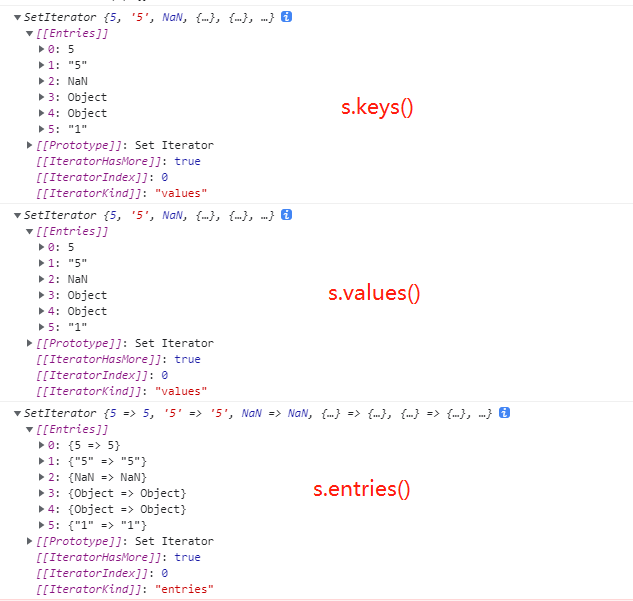
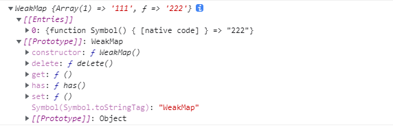
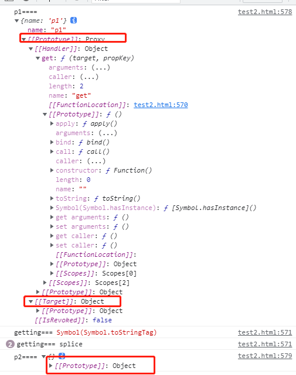
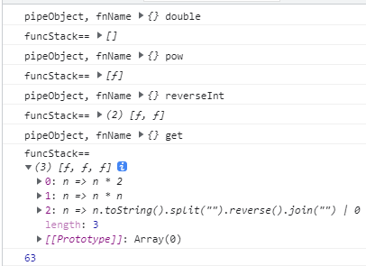
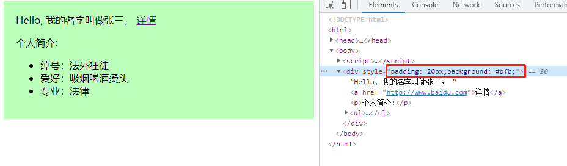

[TOC]


# 一、ECMAScript引出

## 1、什么是ECMA和ECMAScript

`ECMA`（European Computer Manufacturers Association）中文名称为欧洲计算机制造商协会, 这个组织的目标是评估、开发和认可电信和计算机标准. 1994 年后该 组织改名为 Ecma 国际. 

`ECMAScript` 是由 Ecma 国际通过 ECMA-262 标准化的脚本程序设计语言. 

2、


# 二、Symbol

## 1、Symbol概述

- 前提：ES5的对象属性名都是字符串，这容易造成属性名的冲突。如果有一个机制，保证每个属性的名字都是独一无二的就好了，这样就从根本上防止了属性名的冲突。这就是ES6引入Symbol的原型

- 存放在栈内存中

- 定义：ES6引入了一种新的原始数据类型Symbol，表示独一无二的值。它是JavaScript语言的第七种数据类型

- 特性：凡是属性名属于Symbol类型，就都是独一无二的，可以保证不会与其他属性名产生冲突

- 声明：let s = Symbol()

  > 可以接受一个字符串作为参数，表示对Symbol实例的描述，主要是为了在控制台显示，或者转为字符串时，比较容易区分。`Symbol`函数的参数只是表示对当前 Symbol 值的描述，因此相同参数的`Symbol`函数的返回值是不相等的

  - Symbol值转为字符串：Symbol().toString()
  - Symbol值转为布尔值：Boolean(Symbol())

```js
let s1 = Symbol();
typeof s // "symbol"
let s2 = Symbol()
console.log(s1 == s2) // false
let s3 = Symbol(1)
console.log(s3, typeof s3) // Symbol(1) 'symbol'
console.log(s3.toString(), typeof s3.toString()) // Symbol(1) string
console.log(Symbol(1) == Symbol(1)) // false
```

## 2、Symbol作为属性名的遍历

> Symbol作为属性名，遍历对象的时候，该属性不会出现在`for...in`、`for...of`循环中，也不会被`Object.keys()`、`Object.getOwnPropertyNames()`、`JSON.stringify()`返回。

```js
let s1 = Symbol('a')
let s2 = Symbol('b')
let obj = {
	c: 'cccccccc'
}
obj[s1] = 'a'
obj[s2] = 'b'
console.log(obj); // {c: 'cccccccc', Symbol(a): 'a', Symbol(b): 'b'}
// 使用Symbol定义的属性名没有遍历出来
for (let key in obj) {
	console.log('====', key); // c
}
console.log(Object.getOwnPropertyNames(obj)); // ['c']
console.log(Object.keys(obj)); // ['c']
console.log(Object.values(obj)); // ['cccccccc']
console.log(JSON.stringify(obj)); // '{"c":"cccccccc"}'
```

> `Object.getOwnPropertySymbols()`方法，可以获取指定对象的所有 Symbol 属性名。该方法返回一个数组，成员是当前对象的所有用作属性名的Symbol值

```js
let s1 = Symbol('a')
let s2 = Symbol('b')
let obj = {
	c: 'cccccccc'
}
obj[s1] = 'a'
obj[s2] = 'b'
console.log(Object.getOwnPropertySymbols(obj)) // [Symbol(a), Symbol(b)]
```

> Reflect.ownKeys()方法可以返回所有类型的键名，包括常规键名和Symbol键名

```js
console.log(Reflect.ownKeys(obj)) // ['c', Symbol(a), Symbol(b)]
```

### ①、利用Symbol设置只用于内部的方法

由于以 Symbol 值作为键名，不会被常规方法遍历得到。我们可以利用这个特性，为对象定义一些非私有的、但又希望只用于内部的方法。

```js
const size = Symbol('size')
class Collection {
	constructor () {
		this[size] = 0
		this.arr = []
	}
	add(item) {
		this.arr[this[size]] = item
		this[size]++
	}
	sizeOf(instance){
		return instance[size]
	}
}

let fn = new Collection()
console.log(fn.sizeOf(fn)); // 0
fn.add('第一')
console.log(fn.sizeOf(fn)); // 1
console.log(fn.arr); // ['第一']
Object.keys(fn) //  
Object.getOwnPropertyNames(fn) //  
console.log(Object.getOwnPropertySymbols(fn)); //[Symbol(size)]
console.log(Reflect.ownKeys(fn)); //['arr', Symbol(size)]
```

上面代码中，对象`fn`的`size`属性是一个 Symbol 值，所以`Object.keys(fn)`、`Object.getOwnPropertyNames(fn)`都无法获取它。这就造成了一种非私有的内部方法的效果。

## 3、Symbol.for()，Symbol.keyFor()

### ①、Symbol.for()

有时，我们希望重新使用同一个Symbol值，`Symbol.for()`方法可以做到这一点。它接受一个字符串作为参数，然后搜索有没有以该参数作为名称的 Symbol 值。如果有，就返回这个 Symbol 值，否则就新建一个以该字符串为名称的 Symbol 值，并将其注册到全局。

```js
let s1 = Symbol('1')
let s2 = Symbol('1')
let s3 = Symbol.for('1')
let s4 = Symbol.for('1')
console.log(s1 === s2); // false
console.log(s3 === s4); // true
```

- Symbol()和Symbol.for()的区别

  > - Symbol.for()会被登记在全局环境中供搜索，而Symbol不会
  >
  > - Symbol.for()不会每次调用就返回一个新的Symbol类型的值，而是先检查给定的key是否已经存在，如果不存在才会新建一个值。而Symbol会直接创建一个新的值。
  >
  >   比如，如果你调用`Symbol.for("cat")`30 次，每次都会返回同一个 Symbol 值，但是调用`Symbol("cat")`30 次，会返回 30 个不同的 Symbol 值。

### ②、Symbol.keyFor()

> 返回一个已登记的Symbol类型值的key。（就是返回Symbol.for(key)的key值）

```js
let s1 = Symbol('1')
let s3 = Symbol.for('1')
console.log(Symbol.keyFor(s1)); // undefined s1没有登记
console.log(Symbol.keyFor(s3)); // 1
```

### ③、注意

`Symbol.for()`为 Symbol 值登记的名字，是全局环境的，不管有没有在全局环境运行

```js
function foo() {
  return Symbol.for('bar');
}
const x = foo();
const y = Symbol.for('bar');
console.log(x === y); // true
```

上面代码中，`Symbol.for('bar')`是函数内部运行的，但是生成的 Symbol 值是登记在全局环境的。所以，第二次运行`Symbol.for('bar')`可以取到这个 Symbol 值。

`Symbol.for()`的这个全局登记特性，可以用在不同的 iframe 或 service worker 中取到同一个值。

```js
iframe = document.createElement('iframe');
iframe.src = String(window.location);
document.body.appendChild(iframe);
iframe.contentWindow.Symbol.for('foo') === Symbol.for('foo')
// true
```

## 4、内置的Symbol值

### ①、Symbol.hasInstance

> 对象的Symbol.hasInstance属性，指向一个内部方法。当其他对象使用instanceof运算符，判断是否为对象的实例时，会调用这个方法。比如foo instanceof Foo`在语言内部，实际调用的是`Foo[Symbol.hasInstance] (foo)，返回布尔值

```js
	class MyClass {
	[Symbol.hasInstance](name){
		console.log(name); // 1 0
		return Boolean(name)  // 返回布尔值
	}
}
console.log(1 instanceof new MyClass()); // true
console.log(0 instanceof new MyClass()); // false

// 判断一个数是否为偶数

class Even {
	[Symbol.hasInstance](name){
		return Number(name) % 2 === 0
	}
}
// 上面等同于
const Even2 = {
    [Symbol.hasInstance](name){
		return Number(name) % 2 === 0
	}
}
console.log(1 instanceof new Even()); // false
console.log(2 instanceof new Even()); // true
console.log(0 instanceof Even2); // true
console.log(3 instanceof Even2); // false
```

### ②、Symbol.isConcatSpreadable

> 对象的`Symbol.isConcatSpreadable`属性是一个布尔值，表示该对象用于`Array.prototype.concat()`时，是否可以展开，为true可以展开，为false不展开

- 数组的默认行为是可以展开的，Symbol.isConcatSpreadable默认等于undefined。

```js

let arr1 = [1,2]
let arr2 = [3,4]
console.log(arr2[Symbol.isConcatSpreadable]); // undefined
console.log(arr2.concat(arr1, 5,6)); // [3, 4, 1, 2, 5, 6]
arr2[Symbol.isConcatSpreadable] = false
console.log(arr2.concat(arr1, 7,8)); // [[3, 4], 1, 2, 7, 8]
arr1[Symbol.isConcatSpreadable] = false
console.log(arr2.concat(arr1, 7,8)); // [[3, 4], [1, 2], 7, 8]
```

- 类似数组的对象正好相反，默认不展开。它的Symbol.isConcatSpreadable设置为true，才可以展开

```js
let obj1 = { 
	a: 1,
	b: 2
}
let obj2 = { // 类似数组结构的对象
	length: 2,
	0: 1,
	1: 2
}
let arr3 = [9,10]
console.log(arr3.concat(obj1, '哈哈哈')); // [9, 10, {a: 1, b: 2}, "哈哈哈"]
console.log(arr3.concat(obj2, '哈哈哈')); // [9, 10, {length: 2, 0: 1, 1: 2}, "哈哈哈"]
obj1[Symbol.isConcatSpreadable] = true
obj2[Symbol.isConcatSpreadable] = true
console.log(arr3.concat(obj1, '哈哈哈')); // [9, 10 "哈哈哈"]
// obj1 设置Symbol.isConcatSpreadable为true后 就不展示了
console.log(arr3.concat(obj2, '哈哈哈')); // 类数组的对象正常解构了 [9, 10, 1, 2, '哈哈哈']
```

- `Symbol.isConcatSpreadable`属性也可以定义在类里面。

```js
class A1 extends Array {
  constructor(args) {
    super(args);
    this[Symbol.isConcatSpreadable] = true;
  }
}
class A2 extends Array {
  constructor(args) {
    super(args);
  }
  get [Symbol.isConcatSpreadable] () {
    return false;
  }
}
let a1 = new A1();
a1[0] = 3;
a1[1] = 4;
let a2 = new A2();
a2[0] = 5;
a2[1] = 6;
[1, 2].concat(a1).concat(a2)
// [1, 2, 3, 4, [5, 6]]
```

### ③、Symbol.species

> 对象的`Symbol.species`属性，指向一个构造函数。创建衍生对象时，会使用该属性。

```js
class MyArray extends Array {
}
const a = new MyArray(1, 2, 3);
const b = a.map(x => x);
const c = a.filter(x => x > 1);
console.log(b instanceof MyArray); // true
console.log(c instanceof MyArray); // true
console.log(b instanceof Array); // true
console.log(c instanceof Array); // true
```

上面代码中，子类`MyArray`继承了父类`Array`，`a`是`MyArray`的实例，`b`和`c`是`a`的衍生对象。你可能会认为，`b`和`c`都是调用数组方法生成的，所以应该是数组（`Array`的实例），但实际上它们也是`MyArray`的实例。

`Symbol.species`属性就是为了解决这个问题而提供的。现在，我们可以为`MyArray`设置`Symbol.species`属性。

```js
class MyArray extends Array {
  static get [Symbol.species]() { return Array; }
}
```

上面代码中，由于定义了`Symbol.species`属性，创建衍生对象时就会使用这个属性返回的函数，作为构造函数。这个例子也说明，定义`Symbol.species`属性要采用`get`取值器。默认的`Symbol.species`属性等同于下面的写法。

```js
static get [Symbol.species]() {
  return this;
}
```

现在，再来看前面的例子。

```js
class MyArray extends Array {
  static get [Symbol.species]() { return Array; }
}
const a = new MyArray();
const b = a.map(x => x);
b instanceof MyArray // false
b instanceof Array // true
```

上面代码中，`a.map(x => x)`生成的衍生对象，就不是`MyArray`的实例，而直接就是`Array`的实例。

再看一个例子。

```js
class T1 extends Promise {
}
class T2 extends Promise {
  static get [Symbol.species]() {
    return Promise;
  }
}
new T1(r => r()).then(v => v) instanceof T1 // true
new T2(r => r()).then(v => v) instanceof T2 // false
```

上面代码中，`T2`定义了`Symbol.species`属性，`T1`没有。结果就导致了创建衍生对象时（`then`方法），`T1`调用的是自身的构造方法，而`T2`调用的是`Promise`的构造方法。

总之，`Symbol.species`的作用在于，实例对象在运行过程中，需要再次调用自身的构造函数时，会调用该属性指定的构造函数。它主要的用途是，有些类库是在基类的基础上修改的，那么子类使用继承的方法时，作者可能希望返回基类的实例，而不是子类的实例。

### ④、Symbol.match

对象的Symbol.match属性，指向一个函数。当执行`str.match(obj)`时，如果该属性存在，会调用它，返回该方法的返回值

```js
String.prototype.match(regexp)
// 等同于
regexp[Symbol.match](this)
class MyMatcher {
  [Symbol.match](string) {
    return 'hello world'.indexOf(string);
  }
}
'e'.match(new MyMatcher()) // 1
```

### ⑤、Symbol.replace

`Symbol.replace` 这个属性指定了当一个字符串替换所匹配字符串时所调用的方法。[`String.prototype.replace()`](https://www.apiref.com/javascript-zh/Reference/Global_Objects/String/replace.htm) 方法会调用此方法。

```js
class Replace1 {
  constructor(value) {
    this.value = value;
  }
  [Symbol.replace](string) {
    return `s/${string}/${this.value}/g`;
  }
}

console.log('foo'.replace(new Replace1('bar')));
// expected output: "s/foo/bar/g"

```

### ⑥、Symbol.search

对象的`Symbol.search`属性，指向一个方法，当该对象被`String.prototype.search`方法调用时，会返回该方法的返回值。

```js
String.prototype.search(regexp)
// 等同于
regexp[Symbol.search](this)
class MySearch {
  constructor(value) {
    this.value = value;
  }
  [Symbol.search](string) {
    return string.indexOf(this.value);
  }
}
'foobar'.search(new MySearch('foo')) // 0
```

### ⑦、Symbol.split

对象的`Symbol.split`属性，指向一个方法，当该对象被`String.prototype.split`方法调用时，会返回该方法的返回值。

```js
class MySplitter {
  constructor(value) {
    this.value = value;
  }
  [Symbol.split](string) {
    let index = string.indexOf(this.value);
    if (index === -1) {
      return string;
    }
    return [
      string.substr(0, index),
      string.substr(index + this.value.length)
    ];
  }
}
'foobar'.split(new MySplitter('foo'))
// ['', 'bar']
'foobar'.split(new MySplitter('bar'))
// ['foo', '']
'foobar'.split(new MySplitter('baz'))
// 'foobar'
```

### ⑧、Symbol.iterator

对象的Symbol.iterator属性，指向该对象的默认遍历器方法，给其他复合类型部署了Symbol.iterator迭代器，提供统一的遍历接口

- yield： 是ES6的新关键字，使生成器函数执行暂停，yieId关键字后面的表达式的值返回给生成器的调用者。它可以被认为是一个基于**生成器的版本的return关键字**

```js
const myIterable = {a: 1};
myIterable[Symbol.iterator] = function* () {
  yield 1;
  yield 2;
  yield 3;
};
console.log(myIterable);
console.log([...myIterable]);// [1, 2, 3]
```

对象进行for...of循环时，会调用Symbol.iterator方法，返回该对象的默认遍历器

```js
class Collection {
  *[Symbol.iterator]() {
    let i = 0;
    while(this[i] !== undefined) {
      yield this[i];
      ++i;
    }
  }
}
let myCollection = new Collection();
myCollection[0] = 1;
myCollection[1] = 2;
console.log(myCollection);
for(let value of myCollection) {
  console.log(value); // 1 2
}
```

### ⑨、Symbol.toPrimitive

### ⑩、Symbol.toStringTag


# 三、Iterator遍历器和for...of

## 1、Iterator概念

- 前提：JavaScript原有的表示“集合”的数据结构，主要是**`数组（Array）`**和**`对象（Object）`**，ES6又添加了**`Map`**和**`Set`**。用户还可以组合使用它们，定义自己的数据结构，比如数组的成员是Map，Map的成员是对象。这样就需要一种统一的接口机制，来处理所有不同的数据结构。

- 定义：遍历器是一种接口，为各种不同的数据结构提供统一的访问机制，任何数据结构只要部署Iterator接口，就可以完成遍历操作（即依次处理该数据结构的所有成员）

- 作用：

  > - 1、为各种数据结构，提供一个统一的。简单的访问接口
  > - 2、是数据结构的成员能够按某种次序排列
  > - 3、ES6创造了一种新的遍历命令`for...of`循环，Iterator接口主要提供`for...of`消费

- 遍历过程

  > - 1、创建一个指针对象，指向当前数据结构的起始位置。也就是说，遍历器对象本质上，就是一个指针对象
  > - 2、第一次调用指针对象的`nex`t方法，可以将指针指向数据结构的第一个成员
  > - 3、第二次调用指针对象的`next`方法，指针就指向数据结构的第二个成员
  > - 4、不断调用指针对象的`next`方法，直到指向数据结构的结束位置
  >
  > 每一次调用next方法，都会返回数据结构的当前成员的信息。就是返回一个包含value和done两个属性的对象。其中value属性是当前成员的值，done属性是一个布尔值，表示遍历是否结束

- 模拟next方法返回值

  ```js
  let it = makeIterator(['a', 'b'])
  console.log(it.next()); // {value: 'a', done: false}
  console.log(it.next()); // {value: 'b', done: false}
  console.log(it.next()); // {value: undefined, done: true}
  console.log(it.next()); // {value: undefined, done: true}
  function makeIterator (arr) {
      let oIndex = 0
      return {
  			next: function () {
  			return oIndex < arr.length ? {value: arr[oIndex++], done: false} : {value: undefined, done: true} 
  		}
  	}
  }
  ```

  > 上面代码定义了一个`makeIterator`函数，它是一个遍历器生成函数，作用就是返回一个遍历器对象。对数组`['a', 'b']`执行这个函数，就会返回该数组的遍历器对象（即指针对象）`it`。
  >
  > 指针对象的`next`方法，用来移动指针。开始时，指针指向数组的开始位置。然后，每次调用`next`方法，指针就会指向数组的下一个成员。第一次调用，指向`a`；第二次调用，指向`b`。
  >
  > `next`方法返回一个对象，表示当前数据成员的信息。这个对象具有`value`和`done`两个属性，`value`属性返回当前位置的成员，`done`属性是一个布尔值，表示遍历是否结束，即是否还有必要再一次调用`next`方法。
  >
  > 总之，调用指针对象的`next`方法，就可以遍历事先给定的数据结构。

  对于遍历器对象来说，done:false和value:undefined属性是可以省略的，因此上面的makeIterator函数可以简写成下面的格式

  ```js
  function makeIterator (arr) {
      let oIndex = 0
      return {
  			next: function () {
  			return oIndex < arr.length ? {value: arr[oIndex++]} : {done: true} 
  		}
  	}
  }
  ```

- 无限运行的遍历器对象

  > 由于Iterator只是把接口规格加到数据结构之上，所以，遍历器与它遍历的那个数据结构，实际上是分开的，完全可以写出没有对应数据结构的遍历器对象，或者说用遍历器对象模拟出数据结构

  ```js
  var it = idMaker();
  it.next().value // 0
  it.next().value // 1
  it.next().value // 2
  // ...
  function idMaker() {
    var index = 0;
    return {
      next: function() {
        return {value: index++, done: false}; // 一直都返回FALSE，永远不会结束
      }
    };
  }
  ```


## 2、默认的Iterator接口

Iterator接口的目的，就是为所有数据结构，提供了一种统一的访问机制，即for...of循环。当使用for...of循环遍历某种数据结构时，该循环会自动去寻找Iterator接口。
**一种数据结构只要部署了Iterator接口，我们就可以称这种数据结构是“可遍历的”（Iterator）。**

ES6规定，**默认的Iterator接口部署在数据结构的Symbol.iterator属性**，或者说，一个数据结构只要具有Symbol.iterator属性，这是一个预定义好的，类型为Symbol的特殊值，所以要放在方括号内（参见《Symbol》）

```js
const obj = {
	[Symbol.iterator]: function () {
		return {
			next: function () {
				return {
					value: Math.floor(Math.random() * 10),
					done: true
				}
			}
		}
	}
}
console.log(obj[Symbol.iterator]().next()); // {value: 7, done: true}
```

> 上面代码中，对象`obj`是可遍历的（iterable），因为具有`Symbol.iterator`属性。执行这个属性，会返回一个遍历器对象。该对象的根本特征就是具有`next`方法。每次调用`next`方法，都会返回一个代表当前成员的信息对象，具有`value`和`done`两个属性。

ES6的有些数据结构原生具备Iterator接口（比如数组），即不用任何处理，就可以被for...of循环遍历。原因在于，这些数据结构原生部署了Symbol.iterator属性，另外一些数据结构没有（比如对象）。凡是部署了Symbol.iterator属性的数据结构，就称为部署了遍历器接口。调用这个接口，就好返回一个**遍历器对象**

### ①、原生具备iterator接口的数据结构如下

- Array
- Map
- Set
- String
- TypedArray
- 函数的arguments对象
- NodeList对象

示例：数组的Symbol.iterator属性

```js
let arr = [1,2,3]
let fn = arr[Symbol.iterator]()
console.log(fn.next()); // {value: 1, done: false}
console.log(fn.next()); // {value: 2, done: false}
console.log(fn.next()); // {value: 3, done: false}
console.log(fn.next()); // {value: undefined, done: true}
```

上面代码中，变量`arr`是一个数组，原生就具有遍历器接口，部署在`arr`的`Symbol.iterator`属性上面。所以，调用这个属性，就得到遍历器对象。

对于原生部署 Iterator 接口的数据结构，不用自己写遍历器生成函数，`for...of`循环会自动遍历它们。除此之外，其他数据结构（主要是对象）的 Iterator 接口，都需要自己在`Symbol.iterator`属性上面部署，这样才会被`for...of`循环遍历。

对象（Object）之所以没有默认部署iterator接口，是因为对象的哪个属性先遍历，哪个属性后遍历是不确定的，需要手动指定。本质上，遍历器是一种线性处理，对于任何非线性的数据结构，部署遍历器接口，就等于部署一种线性转换。不过，严格来说，对象部署遍历器接口并不是很必要，因为这时对象实际被当做Map结构使用

```js
class RangeIterator {
  constructor(start, stop) {
    this.value = start;
    this.stop = stop;
  }
  [Symbol.iterator]() { return this; }
  next() {
    var value = this.value;
    if (value < this.stop) {
      this.value++;
      return {done: false, value: value};
    }
    return {done: true, value: undefined};
  }
}
function range(start, stop) {
  return new RangeIterator(start, stop);
}
for (var value of range(0, 3)) {
  console.log(value); // 0, 1, 2
}
```

上面代码是一个类部署 Iterator 接口的写法。`Symbol.iterator`属性对应一个函数，执行后返回当前对象的遍历器对象。

### ②、通过遍历器实现指针结构

```js
function Obj(value) {
	this.value = value
	this.next = null
}
Obj.prototype[Symbol.iterator] = function () {
	let iterator = {
		next: next
	}
	let that = this
	function next () {
		if (that) {
			let value = that.value
			that = that.next
			return { done: false, value: value }
		} else {
			return { done: true}
		}
	}
	return iterator
}
let one = new Obj('111')
let two = new Obj('222')
console.log(one.next); // null
for (var i of one){
  console.log(i); // 111
}
one.next = two
console.log(one.next); // Obj {value: '222', next: null} 
for (var i of one){
  console.log(i); // 111 222
}
```

> 上面代码首先在构造函数的原型链上部署Symbol.iterator方法，调用该方法会返回遍历器对象iterator，调用该对象的next方法，在返回一个值的同时，自动将内部指针移到下一个实例

### ③、为对象添加Iterator接口的例子

```js
let obj = {
	data: ['111', '222'],
	[Symbol.iterator]() {
		const that = this
		return {
			next(){
				if (this.index < that.data.length){
					return {
						value: that.data[this.index++],
						done: false
					}
				} else {
					return {
						done: true
					}
				}
			},
			index: 0
		}
	}
}
// console.log(obj[Symbol.iterator].next);
for (let value of obj) {
	console.log('value---', value) // 111 222
}

let obj2 = {
	[Symbol.iterator] () {
       let index =0
       let _this = this
		return {
			next:function(){
				if (this.i < 3) {
					this.i++
					return {value: this.i,done:false}
				} else {
					
					return {done:true}
				}
			},
			i: 0
		}
	}
}
for (val of obj2) {
	console.log('===', val); // 1 2 3
}
```

## 3、调用Iterator接口的场合

有一些场合会默认调用iterator接口（即Symbol.iterator方法）

### ①、结构赋值

> 对数组和Set结构进行结构赋值时，会默认调用Symbol.iterator方法

```js
let set = new Set().add('hello').add('呀！').add('呀！！')
let [a,b] = set
console.log(a, b); // hello 呀！
let [c, ...d] = set
console.log(c, d); // hello ['呀！', '呀！！']
```

### ②、扩展运算符

> 扩展运算符（...）也会默认调用iterator接口

```js
// 例一
var str = 'hello';
[...str] //  ['h','e','l','l','o']
// 例二
let arr = ['b', 'c'];
['a', ...arr, 'd']
// ['a', 'b', 'c', 'd']
```

上面代码的扩展运算符内部就调用iterator接口

实际上，这提供了一种简单机制，可以将任何部署了iterator接口的数据结构，转为数组。也就是说，只要某个数据结构部署了iterator接口，就可以对它使用扩展运算符，将其转为数组

```js
let arr = [...iterable]
```

### ③、yieid*

> yieid*后面跟的是一个可遍历的结构，它会调用该结构的遍历器接口

> yield： 是ES6的新关键字，使生成器函数执行暂停，yieId关键字后面的表达式的值返回给生成器的调用者。它可以被认为是一个基于**生成器的版本的return关键字**

```js
let generator = function* () {
  yield 1;
  yield* [2,3,4];
  yield 5;
};
var iterator = generator();
iterator.next() // { value: 1, done: false }
iterator.next() // { value: 2, done: false }
iterator.next() // { value: 3, done: false }
iterator.next() // { value: 4, done: false }
iterator.next() // { value: 5, done: false }
iterator.next() // { value: undefined, done: true }
```

### ④、字符串的iterator接口

> 字符串是一个类似数组的接口，也原生具有iterator接口

```js
let str = '加油鸭哈3'
let strIter = str[Symbol.iterator]()
console.log(strIter.next()); 
console.log(strIter.next());
console.log(strIter.next());
console.log(strIter.next());
console.log(strIter.next());
console.log(strIter.next());
/* 
 {value: '加', done: false}
{value: '油', done: false}
test2.html:330 {value: '鸭', done: false}
test2.html:331 {value: '哈', done: false}
test2.html:332 {value: '3', done: false}
test2.html:333 {value: undefined, done: true}
*/
```

上面代码中，调用`Symbol.iterator`方法返回一个遍历器对象，在这个遍历器上可以调用 next 方法，实现对于字符串的遍历。

可以覆盖原生的`Symbol.iterator`方法，达到修改遍历器行为的目的。

```js
// let str = '加油鸭'  直接这样创建不会执行str[Symbol.iterator] 方法
let str = new String('加油鸭')
console.log(str); // String {'加油鸭'}
console.log([...str]); // ['加', '油', '鸭']
str[Symbol.iterator] = function () {
	return {
		next () {
			if (this.first) {
				this.first = false
				return {value: '哈哈哈', done: false}
			} else {
				return { done: true}
			}
		},
		first: true
	}
}
console.log([...str]);
console.log(str); // String {'加油鸭', Symbol(Symbol.iterator): ƒ}
```

上面代码中，字符串 str 的`Symbol.iterator`方法被修改了，所以扩展运算符（`...`）返回的值变成了`哈哈哈`，而字符串本身还是`加油鸭`。

- 注意：直接使用let str = '加油鸭'赋值， str 的`Symbol.iterator`修改的方法不会被调用

## 4、Iterator接口与Generator函数

```js
let myIterable = {
  [Symbol.iterator]: function* () {
    yield 1;
    yield 2;
    yield 3;
  }
}
[...myIterable] // [1, 2, 3]
// 或者采用下面的简洁写法
let obj = {
  * [Symbol.iterator]() {
    yield 'hello';
    yield 'world';
  }
};
for (let x of obj) {
  console.log(x);
}
// "hello"
// "world"
```

## 5、for...of循环

一个数据结构只要部署了`Symbol.iterator`属性，就被视为具有 iterator 接口，就可以用`for...of`循环遍历它的成员。也就是说，`for...of`循环内部调用的是数据结构的`Symbol.iterator`方法。

`for...of`循环可以使用的范围包括数组、Set 和 Map 结构、某些类似数组的对象（比如`arguments`对象、DOM NodeList 对象）、后文的 Generator 对象，以及字符串。

```js
const arr = ['red', 'green', 'blue'];
for(let v of arr) {
  console.log(v); // red green blue
}
const obj = {};
obj[Symbol.iterator] = arr[Symbol.iterator].bind(arr);
for(let v of obj) {
  console.log(v); // red green blue
}
```

上面代码中，空对象`obj`部署了数组`arr`的`Symbol.iterator`属性，结果`obj`的`for...of`循环，产生了与`arr`完全一样的结果。

`for...of`循环可以代替数组实例的`forEach`方法。

```js
const arr = ['red', 'green', 'blue'];
arr.forEach(function (element, index) {
  console.log(element); // red green blue
  console.log(index);   // 0 1 2
});
```

### 与其他遍历语法比较

#### 1）for循环

```
let arr = [1, 2, 3]
for (let index = 0; i< arr.length; i++){
	console.log(arr[index])
}
```

> 这种写法比较玛法所以数组提供了内置的forEach方法

#### 2）forEach

```js
let arr = [1, 2, 3]
arr.forEach((item, index)=>{
    console.log(item, index)
})
```

> 这种写法的问题在于，无法中途跳出forEach循环，break命令或return命令都不能奏效

#### 3）for...in循环

可以遍历数组的键名

```js
let arr = [1, 2, 3]
for (let index in arr) {
  console.log(arr[index]);
}
```

缺点：

> - 数组的键名是数字，但是for...in循环是以字符串作为键名“0”、“1”、“2”等等。
>
> - for...in循环不仅遍历数字键名，还会遍历手动添加的其他键，甚至包括原型链上的键
> - 某些情况下，for...in循环会以任意顺序遍历键名

总之，for...in循环主要是为遍历对象而设计的，不适用遍历数组

#### 4）for...of

```js
let arr = [1, 2, 3]
for (let value of arr) {
  console.log(value);
}
```

优点：

- 有着同`for...in`一样的简洁语法，但是没有`for...in`那些缺点。
- 不同于`forEach`方法，它可以与`break`、`continue`和`return`配合使用。
- 提供了遍历所有数据结构的统一操作接口。

```js
for (var n of fibonacci) {
  if (n > 1000)
    break;
  console.log(n);
}
```

上面的例子，会输出斐波纳契数列小于等于 1000 的项。如果当前项大于 1000，就会使用`break`语句跳出`for...of`循环。

# 四、Set和Map的数据结构

## Ⅰ、Set的数据结构

### 1、Set基本用法

- 定义：`新的数据结构 Set`，类似于数组但是值都是唯一的，没有重复的值

- 声明：const s = new Set(arr)

- 入参：可以接受一个数组（或者具有 iterable 接口的其他数据结构）作为参数，用来初始化

- 应用场景：**数组去重，字符串去重**

- 用法：

  ```js
  const s = new Set([1,2,3,3,3,4,6,1,2])
  console.log(s); //Set(5) {1, 2, 3, 4, 6}
  console.log(typeof s, s instanceof Array, s instanceof Set); // Object false true
  console.log(Array.from(s)); // [1, 2, 3, 4, 6]
console.log([...s]); // [1, 2, 3, 4, 6] // 转换为数组
  console.log('--------------');
  const s2 = new Set('aaabbbcccdefs') 
  console.log(s2);// Set(7) {'a', 'b', 'c', 'd', 'e', …}
  console.log([...s2].join()); // a,b,c,d,e,f,s  去除重复字符串
  ```
  
- 注意：向Set加入值的时候，不会发生类型转换，也就是说：5和"5"是两个不同的值。**`Set内部判断两个值是否相同，类似于全等（===），但是Set认为NaN和NaN相等，两个对象总是不想等的`**

  ```js
  const s = new Set([5, '5', NaN, NaN, {}, {}])
  console.log(s); // Set(5) {5, '5', NaN, {…}, {…}} 0: 5 1: "5" 2: NaN 3: Object 4: Object
  ```

### 2、Set 实例的属性和方法

#### ①、属性

- **Set.prototype.constructor**: 构造函数, 返回Set函数
- **Set.prototype.size**: 返回实例成员总数

#### ②、方法

**a、操作方法，用于操作数据**

- **Set.prototype.add(value)**：添加某个值，返回Set函数
- **Set.prototype.delete(value)**：删除某个值，返回一个布尔值，表示删除是否成功
- **Set.prototype.has(value)**：返回一个布尔值，表示该值是否在Set函数中
- **Set.prototype.clear()**：清除所有Set函数的值，没有返回值

**b、遍历方法，用于遍历数据**

- **Set.prototype.keys()**：返回键名的遍历器
- **Set.prototype.values()**：返回键值的遍历器
- **Set.prototype.entries()**：返回键值对的遍历器
- **Set.prototype.foreach()**：使用回调函数遍历每个成员（使用方法类似数组遍历）

`由于 Set 结构没有键名，只有键值（或者说键名和键值是同一个值），所以keys方法和values方法的行为完全一致`，这意味着，可以省略`values`方法，直接用`for...of`循环遍历 Set。

#### ③、示例

- **`属性方法`**：add delete has clear 增删查清

  ```js
  const s = new Set([5, '5', NaN, NaN, {}, {}])
  const s2 = new Set([5, '5', NaN])
  console.log(s.constructor, s.size); // ƒ Set() { [native code] } 5
  // add delete has clear 增删查清
  console.log(s.add('1')); // Set(6) {5, '5', NaN, {…}, {…}, 1} 0: 5 1: "5" 2: NaN 3: Object 4: Object 5: "1"
  console.log(s2.delete(5), s2); // true Set(2) {'5', NaN}
  console.log(s.has('2')); // false 
  console.log(s.has('5')); // true 
  console.log(s2.clear(), s2); // undefined Set(0) {}
  ```

- **`遍历方法`**： keys values entries foreach 键名 键值 键值对 所有

  ```js
  // keys values entries foreach 键名 键值 键值对 所有
  console.log(s.keys());
  console.log(s.values());
  console.log(s.entries());
  // foreach 类似数组
  s3.forEach((item,index)=>{
  console.log('foreach===',item,index); 
  // foreach=== a a 
  // foreach=== b b 
  
  // for of
  let set = new Set(['red', 'green', 'blue']);
  for (let x of set) {
    console.log(x);
  }
  // red
  // green
  // blue
  ```



- **判断 姓名与年龄 是否重复,如果重复则不予通过**

  ```js
  // 判断 姓名与年龄 是否重复,如果重复则不予通过
  const tempLists =  [
  {name:'张三',age:'10'},
  {name:'张三',age:'11'},
  {name:'李四',age:'10'},
  {name:'李四',age:'10'}
  ]
  // 姓名与年龄如果都相同,则认为是重复对象
  const tempSetArr = new Set()
  tempLists.map(item => {
  // 利用Set数组的唯一性,将姓名与年龄拼接,加入后如果重复则不会加入
  	tempSetArr.add(`${item.name}${item.age}`)
  })
  console.log(tempSetArr);
  // 判断去重后的数组长度是否与当前界面上的长度一致,如果不一致,则输入的内容重复了,校验不通过
  if (tempSetArr.size !== tempLists.length) {
  	console.log('列表不可有重复项，请修改后重新提交')
  }
  ```

- **两个数组的并集，交集，差集**

  ```js
  // 两个数组的并集，交集，差集
  let arr1 = [1,2,3]
  let arr2 = [2,3,4]
  let s1 = new Set()
  let s2 = new Set(arr2)
  arr1.forEach(item=>{s1.add(item)}) 
  
  // s1和s2的并集
  let union = new Set([...s1, ...s2])
  console.log(union); //并集 Set(4) {1, 2, 3, 4}
  
  // s1和s2的交集
  let intersect = new Set([...s1].filter(item=>s2.has(item)))
  console.log(intersect); //交集 Set(2) {2, 3}
  
  // s1 相对 s2 的差值
  let difference = new Set([...s1].filter(item=>!s2.has(item)))
  console.log(difference); //差集 Set(1) {1}
  ```

### 3、WeakSet

#### ①、含义

WeakSet结构与Set类似，也是不重复的值的集合。但是，它与Set有两个区别

- 1、WeakSet的成员只能是对象，而不能是其他类型的值

```js
let a = new WeakSet('111234')
console.log(a);// Invalid value used in weak set
let b = new WeakSet([1,2,3]) //Invalid value used in weak set
let b = new WeakSet([[1,2,3]]) // WeakSet {Array(3)}
```

- 2、WeakSet中的对象都是弱引用，即垃圾回收机制不考虑WeakSet对该对象的引用，也就是说，**`如果其他对象都不再引用该对象，那么垃圾回收机制会自动回收该对象所占用的内存，不考虑该对象还存在WeakSet之中`**。

  <p style="color: red">不引用的时候，一段时间就自动被垃圾回收机制自动回收（可以使用setinterval测试，一段时间后 b 就为空了）</p>

  > 这是因为垃圾回收机制依赖引用计数，如果一个值的引用次数不为`0`，垃圾回收机制就不会释放这块内存。结束使用该值之后，有时会忘记取消引用，导致内存无法释放，进而可能会引发内存泄漏。WeakSet 里面的引用，都不计入垃圾回收机制，所以就不存在这个问题。因此，WeakSet 适合临时存放一组对象，以及存放跟对象绑定的信息。只要这些对象在外部消失，它在 WeakSet 里面的引用就会自动消失。
  >
  > 由于上面这个特点，WeakSet 的成员是不适合引用的，因为它会随时消失。另外，由于 WeakSet 内部有多少个成员，取决于垃圾回收机制有没有运行，运行前后很可能成员个数是不一样的，而垃圾回收机制何时运行是不可预测的，因此 ES6 规定 WeakSet 不可遍历。

#### ②、语法

作为构造函数，WeakSet 可以接受一个数组或类似数组的对象作为参数。（实际上，任何具有 Iterable 接口的对象，都可以作为 WeakSet 的参数。）该数组的所有成员，都会自动成为 WeakSet 实例对象的成员

```js
const a = [[1, 2], [3, 4]];
const ws = new WeakSet(a);
// WeakSet {[1, 2], [3, 4]}
```

上面代码中，`a`是一个数组，它有两个成员，也都是数组。将`a`作为 WeakSet 构造函数的参数，`a`的成员会自动成为 WeakSet 的成员。

注意，是`a`数组的成员成为 WeakSet 的成员，而不是`a`数组本身。这意味着，数组的成员只能是对象。

```js
const b = [3, 4];
const ws = new WeakSet(b);
// Uncaught TypeError: Invalid value used in weak set(…)
```

上面代码中，数组`b`的成员不是对象，加入 WeakSet 就会报错。

WeakSet 结构有以下三个方法。

- **WeakSet.prototype.add(value)**：向 WeakSet 实例添加一个新成员。
- **WeakSet.prototype.delete(value)**：清除 WeakSet 实例的指定成员。
- **WeakSet.prototype.has(value)**：返回一个布尔值，表示某个值是否在 WeakSet 实例之中。

示例：

```js
const ws = new WeakSet();
const obj = {};
const foo = {};
ws.add(window);
ws.add(obj);
ws.has(window); // true
ws.has(foo);    // false
ws.delete(window);
ws.has(window);    // false
```

WeakSet 不能遍历，所以也没有size和foreach等方法，是因为成员都是弱引用，随时可能消失，遍历机制无法保证成员的存在，很可能刚刚遍历结束，成员就取不到了。WeakSet 的一个用处，是储存 DOM 节点，而不用担心这些节点从文档移除时，会引发内存泄漏。

#### ③、使用场景

- 虚拟dom使用WeakSet优化：防止内存泄漏的方法

可以存储DOM节点

```js
let oDiv = document.createElement('div') // 虚拟dom
oDiv.style.color = '#f00'
oDiv.innerHTML = 'hello, 你好呀'
document.body.appendChild(oDiv) // 添加到body中
document.body.removeChild(oDiv) // div是不显示了，但是内存中还是存在虚拟dom,占用内存
```

虚拟dom使用WeakSet优化，当节点被移除后，自动回收

```js

```

## Ⅱ、Map的数据结构

### 1、Map的基本用法

https://blog.csdn.net/weixin_45992710/article/details/103990974 (weakmap)

- 定义：`新的数据结构 Map`，它类似于对象，也是键值对的集合，但是键值不限于字符串，可以是任意类型（包括对象）

- 声明：const m = new Map([arr])

- 入参：任何具有Iterator 接口、且每个成员都是**`双元素的数组`**的数据结构。Set和Map都可以作为入参

- 用法：

  ```js
  let m = new Map([[1, 2]])
  console.log(m); // Map(1) {1 => 2}
let m2 = new Map({a: '哈哈哈哈', b: '好开心呀'}) // object不具有iterator结构
  console.log(m2); // object is not iterable (cannot read property Symbol(Symbol.iterator)) 
  ```
  

### 2、Map实例的属性和方法

#### ①、属性

- **size属性**：返回Map结构的成员总数
- **Map.prototype.set(key, value)**：set方法设置键名key对应的键值为value，然后返回整个Map结构。如果key已经有值，则键值会被更新，否则就新生成该键
- **Map.prototype.get(key)**：get方法读取key对应的键值，如果找不到key，就返回undefined
- **Map.prototype.has(key)**：has方法返回一个布尔值，表示某个键是否在当前Map对象之中
- **Map.prototype.delete(key)**：delete方法删除某个键，返回true。如果删除失败，返回false
- **Map.prototype.clear()**：clear方法清除所有成员，没有返回值

```js
let m = new Map([['咔嚓', '哎呀'], ['22', '22==22']]) 
console.log(m.has('O(∩_∩)O哈哈~')); // false
console.log(m.get('O(∩_∩)O哈哈~')); // undefined
console.log(m.get('咔嚓')); // 哎呀
m.set('O(∩_∩)O哈哈~', '啦啦啦')
console.log(m.has('O(∩_∩)O哈哈~')); // true
console.log(m.get('O(∩_∩)O哈哈~')); // 啦啦啦
console.log(m.delete('咔嚓')); // true 表示删除成功
console.log(m.get('咔嚓')); //已经删除了 所以返回 undefined
console.log(m); // Map(2) {'22' => '22==22', 'O(∩_∩)O哈哈~' => '啦啦啦'}
console.log(m.clear()); //没有返回值  undefined
console.log(m); // Map(0) {}
```

#### ②、方法

Map结构原生提供三个遍历器和一个遍历方法

- **Map.prototype.keys()**：返回键名的遍历器
- **Map.prototype.values()**：返回键值的遍历器
- **Map.prototype.entries()**：返回所有成员的遍历器
- **Map.prototype.forEach()**：遍历Map的所有成员

`注意：Map的遍历顺序就是插入的顺序`

```js
let m = new Map([
	['11', '11==11'],
	['22', '22==22'],
	['33', '33==33']
])
console.log('keys==', m.keys()); // keys== MapIterator {'11', '22', '33'}
for (let key of m.keys()) {
	console.log('kkk===', key); //kkk=== 11 kkk=== 22 kkk=== 33
}
console.log('values==', m.values()); // values== MapIterator {'11==11', '22==22', '33==33'}
for (let val of m.values()) {
	console.log('val===', val); //val=== 11==11 val=== 22==22 val=== 33==33
}
console.log('entries==', m.entries()); // entries== MapIterator {'11' => '11==11', '22' => '22==22', '33' => '33==33'}
for (let entries of m.entries()) {
	console.log('entries===', entries); 
	/* 
		entries=== (2) ['11', '11==11']
		entries=== (2) ['22', '22==22']
		entries=== (2) ['33', '33==33']
	*/
}
// 或者
for (let [key, value] of m.entries()) {
  console.log('entries=2==', key, value);
  /* 
 	entries=2== 11 11==11
	entries=2== 22 22==22
 	entries=2== 33 33==33 
  */
}
// 等同于使用map.entries()
for (let [key, value] of m) {
  console.log('entries=3==', key, value);
  /* 
	entries=3== 11 11==11
	entries=3== 22 22==22
	entries=3== 33 33==33 
  */
}
// 类似.values()方法
m.forEach(item=>{
	console.log('foreach==', item); //foreach=== 11==11 foreach=== 22==22 foreach=== 33==33
})
```

`Map结构的默认遍历器接口（Symbol.iterator）`属性，就是entries方法

```js
map[Symbol.iterator] === map.entries
// true
```

#### ③、与其他数据结构的互相转换

##### 1)、Map 结构转为数组结构

> Map 结构转为数组结构，比较快速的方法是使用扩展运算符（...）

```js
const map = new Map([
    ['11', '11==11'],
    ['22', '22==22'],
    ['33', '33==33']
]);
[...map.keys()]
// [11, 22, 33]
[...map.values()]
// ['11==11', '22==22', '33==33']
[...map.entries()]
// [['11', '11==11'], ['22', '22==22'], ['33', '33==33']]
[...map]
// [['11', '11==11'], ['22', '22==22'], ['33', '33==33']]
```

##### 2)、Map结构转为对象结构

> 如果有非字符串的键名，那么这个键名会被转成字符串，再作为对象的键名

```js
let m = new Map([[1, '11==11']])
m.set(2, '22==22').set(3, '33==33')
function mapToObj(mapObj) {
	let obj = {}
	for (let [key, value] of mapObj.entries()){
		obj[key] = value
	}
	return obj
}
console.log(mapToObj(m)); // {1: '11==11', 2: '22==22', 3: '33==33'}
m.set([1,2,3], '我是一个数组呀')
console.log(mapToObj(m)); // {1: '11==11', 2: '22==22', 3: '33==33', 1,2,3: '我是一个数组呀'}
console.log(mapToObj(m)['1,2,3']); // 我是一个数组呀
```

### 3、WeakMap

#### ①、含义

WeakMap的结构与Map的结构类似，也是用于生成键值对的集合。但是与Map有亮点区别

- WeakMap只接受对象作为键名（null除外），不接受其他类型的值作为键名

```js
let weakM = new WeakMap()
// weakM.set(1, '哈哈哈') 
// console.log(weakM);// Invalid value used as weak map key
weakM.set([1], '111')
console.log(weakM); //WeakMap {Array(1) => '111'}
weakM.set(Symbol, '222')
console.log(weakM); 
```



- WeakMap的键名所指向的对象，不计入垃圾回收机制（和weakmap类似）

`WeakMap`的设计目的在于，有时我们想在某个对象上面存放一些数据，但是这会形成对于这个对象的引用。请看下面的例子。

```js
const e1 = document.getElementById('foo');
const e2 = document.getElementById('bar');
const arr = [
  [e1, 'foo 元素'],
  [e2, 'bar 元素'],
];
```

上面代码中，`e1`和`e2`是两个对象，我们通过`arr`数组对这两个对象添加一些文字说明。这就形成了`arr`对`e1`和`e2`的引用。

一旦不再需要这两个对象，我们就必须手动删除这个引用，否则垃圾回收机制就不会释放`e1`和`e2`占用的内存。

```js
// 不需要 e1 和 e2 的时候
// 必须手动删除引用
arr [0] = null;
arr [1] = null;
```

上面这样的写法显然很不方便。一旦忘了写，就会造成内存泄露。

WeakMap 就是为了解决这个问题而诞生的，它的键名所引用的对象都是弱引用，即垃圾回收机制不将该引用考虑在内。因此，只要所引用的对象的其他引用都被清除，垃圾回收机制就会释放该对象所占用的内存。也就是说，一旦不再需要，WeakMap 里面的键名对象和所对应的键值对会自动消失，不用手动删除引用。

基本上，如果你要往对象上添加数据，又不想干扰垃圾回收机制，就可以使用 WeakMap。一个典型应用场景是，在网页的 DOM 元素上添加数据，就可以使用`WeakMap`结构。当该 DOM 元素被清除，其所对应的`WeakMap`记录就会自动被移除。

总之，`WeakMap`的专用场合就是，它的键所对应的对象，可能会在将来消失。`WeakMap`结构有助于防止内存泄漏。

#### ②、语法

WeakMap 与 Map 在 API 上的区别主要是两个，一是没有遍历操作（即没有`keys()`、`values()`和`entries()`方法），也没有`size`属性。因为没有办法列出所有键名，某个键名是否存在完全不可预测，跟垃圾回收机制是否运行相关。这一刻可以取到键名，下一刻垃圾回收机制突然运行了，这个键名就没了，为了防止出现不确定性，就统一规定不能取到键名。二是无法清空，即不支持`clear`方法。因此，`WeakMap`只有四个方法可用：`get()`、`set()`、`has()`、`delete()`。

#### ③、使用场景

- 虚拟dom使用WeakSet优化：防止内存泄漏的方法

可以存储DOM节点

```js
let oDiv = document.createElement('div') // 虚拟dom
oDiv.style.color = '#f00'
oDiv.innerHTML = 'hello, 你好呀'
document.body.appendChild(oDiv) // 添加到body中
document.body.removeChild(oDiv) // div是不显示了，但是内存中还是存在虚拟dom,占用内存
```

虚拟dom使用WeakSet优化，当节点被移除后，自动回收

```js
let oDiv = document.createElement('div') // 虚拟dom
let oDiv2 = document.createElement('div') // 虚拟dom
oDiv2.style.background = '#ff0'
oDiv2.style.marginTop = '20px'
oDiv.style.background = '#f00'
oDiv.innerHTML = 'hello, 你好呀,我是div1'
oDiv2.innerHTML = 'hello, 你好呀,我是div2'
const key = {name: 'oDiv'}
let oDivMap = new WeakMap()
oDivMap.set(key, oDiv)
console.log();
document.body.appendChild(oDivMap.get(key)) // 添加到body中
document.body.appendChild(oDiv2) // 添加到body中
// document.body.removeChild(oDiv) // div是不显示了，但是内存中还是存在虚拟dom,占用内存
document.body.removeChild(oDivMap.get(key)) // 一定时间后内存就会回收
setInterval(() => {
	console.log(oDivMap);
}, 1000);
```

# 五、Proxy代理器

> vue3.0的双向绑定的底层原理使用Proxy和Reflect进行劫持代理

## 1、概述

> Proxy可以理解成，在目标对象之前架设一层"拦截"，外界对该对象的访问，都必须先通过这层拦截，因此提供了一种机制，可以对外界的访问进行过滤和改写。Proxy可以译为”代理器“

ES6原生提供Proxy构造函数，用来生成Proxy实例

```js
var proxy = new Proxy(target,handler)
```

Proxy对象的所有写法，都是上面的格式，不同的是handler参数的写法。其中，

- **new Proxy()**表示生成一个Proxy实例

- **target**参数表示所要拦截的**目标对象**，

- **handler**参数也是一个对象，**用来定制拦截行为**

```js
let obj = new Proxy({}, {
	get(target, propKey, receiver) {
		console.log(`getting---propKey==${propKey}`);
		return Reflect.get(target, propKey, receiver)
	},
	set(target,propKey, value, receiver) {
		console.log(`setting---propKey==${propKey}、value==${value}`);
		return Reflect.get(target, propKey, value, receiver)
	}
})
obj.num = 1 
// setting---propKey==num、value==1
++obj.num
// getting---propKey==num
// test2.html:529 setting---propKey==num、value==NaN
console.log(obj.num);
// getting---propKey==num
// undefined
```

上面代码对一个空对象设置了一层拦截，重新定义了属性的读（get）和设置（set）方法

```js
let obj2 = new Proxy({}, {
	get(target, propKey, receiver){
		return '法外狂徒'
	}
})
obj2.name = '张三'
console.log(obj2.name); // 法外狂徒
obj2.age = 10
console.log(obj2.age); // 法外狂徒
```

上面代码中，作为构造函数，Proxy接受两个参数。第一个参数是所要代理的目标对象，即如果没有Proxy的介入，操作原来要访问的就是这个对象；第二个参数是一个配置对象，对于每一个被代理的操作，需要提供一个对象的处理函数，该函数将拦截对应的操作。比如，上面代码中，配置对象有一个get方法，用来拦截函数总是返回`法外狂徒`，所以访问任何属性都得到这个`法外狂徒`

- Proxy实例也可以作为其他对象的原型对象

```js
var proxy = new Proxy({}, {
  get: function(target, propKey) {
    return 35;
  }
});
let obj = Object.create(proxy);
obj.time // 35
```

上面代码中，`proxy`对象是`obj`对象的原型，`obj`对象本身并没有`time`属性，所以根据原型链，会在`proxy`对象上读取该属性，导致被拦截。

## 2、Proxy 实例的方法

### ①、get

get(target,propKey, receiver)：用于<strong style="color: red">拦截某个属性</strong>的读取操作

- target：目标对象
- propKey：属性名
- receiver：proxy实例本身（严格地说，是操作行为所针对的对象）可选

```js
var person = {
  name: "张三",
  attr: '法外狂徒'
};
var proxy = new Proxy(person, {
  get: function(target, propKey) {
    if (propKey in target) {
      return console.log(target[propKey]);
    } else {
      throw new ReferenceError("Prop name \"" + propKey + "\" does not exist.");
    }
  }
});
proxy.name // "张三"
proxy.attr // "法外狂徒"
// proxy.work // ReferenceError: Prop name "work" does not exist.
```

上面代码表示，如果访问目标对象不存在的属性，会抛出一个错误。如果没有这个拦截函数，访问不存在的属性，只会返回`undefined`。

#### 1）get举例

##### a、get方法可以继承

```js
let Person = new Proxy ({}, {
	get (target, propKey) {
		console.log('getting===', propKey);
		return target[propKey]
	}
})
let p1 = Object.create(Person)
let p2 = Object.create({})
p1.name = 'p1' // getting=== name
console.log('p1====', p1);
console.log('p2====', p2);
```



##### b、实现数组读取负数的索引

```js
function createArr (...elements) {
	let handler = {
		get(target, propKey) {
			let index = Number(propKey)
			if (propKey < 0) {
				return target[target.length + index]
			} else {
				return target[index]
			}
		}
	}
	let target = []
	target.push(...elements)
	return new Proxy(target, handler)
}
let arr = createArr('a', 'b', 'c');
console.log(arr[1]); // b
console.log(arr[-1]); // c
```

##### c、利用get，转变为执行某个函数，从而实现属性的链式操作

```js
var pipe = function (value) {
  var funcStack = [];
  var oproxy = new Proxy({} , {
    get : function (pipeObject, fnName) {
		console.log('pipeObject, fnName', pipeObject, fnName);
		console.log('funcStack==', funcStack);
      if (fnName === 'get') {
          // fnName ==get 时 return
        return funcStack.reduce(function (val, fn) {
          return fn(val);
        },value);
      }
        // 先将方法汇总到funcStack中
      funcStack.push(window[fnName]);
      return oproxy;
    }
  });
  return oproxy;
}
var double = n => n * 2;
var pow    = n => n * n;
var reverseInt = n => n.toString().split("").reverse().join("") | 0;
// 63
console.log(pipe(3).double.pow.reverseInt.get);
```



##### d、实现一个生成DOM节点的通用dom

```js
let craeteNode = new Proxy({}, {
	get (target, propKey){
		console.log('get==', target, propKey);
		let el = document.createElement(propKey) // 根据传入的属性名创建对应DOM节点
		return function(attrs = {}, ...children) {
            // attrs 函数传入的第一个参数  {style:"padding: 20px"}
            // children 传入的第二个参数
			for(let key of Object.keys(attrs)) {
				el.setAttribute(key, attrs[key])
			}
			for (let child of children) { // 循环取出children节点
				if (typeof child === 'string') {
                    //如果入参类型为字符串,则将其转换为文本节点 
					child = document.createTextNode(child);
				}
				el.appendChild(child);
			}
			console.log('attrs==', attrs, children);
			return el//将子节点插入el中
		}
	}
})
const el = craeteNode.div({style:"padding: 20px"},
  'Hello, 我的名字叫做张三， ',
  craeteNode.a({href: 'http://www.baidu.com'}, '详情'),
  craeteNode.p({}, '个人简介:'),
  craeteNode.ul(
	{},
  	craeteNode.li({}, '绰号：法外狂徒'),
  	craeteNode.li({}, '爱好：吸烟喝酒烫头'),
  	craeteNode.li({}, '专业：法律')
  )
);
document.body.appendChild(el)
```



##### e、Proxy的第三个参数

第三个参数总是指向原始的读操作所在的那个对象，一般情况下就是Proxy实例

```js
const proxy = new Proxy({}, {
  get: function(target, key, receiver) {
    return receiver;
  }
});
console.log(proxy.get === proxy); // true
console.log(proxy.getReceiver === proxy); // true
```

上面代码中，`proxy`对象的`getReceiver`属性是由`proxy`对象提供的，所以`receiver`指向`proxy`对象。

```js
const proxy = new Proxy({}, {
  get: function(target, key, receiver) {
    return receiver;
  }
});
const d = Object.create(proxy);
d.a === d // true
```

上面代码中，`d`对象本身没有`a`属性，所以读取`d.a`的时候，会去`d`的原型`proxy`对象找。这时，`receiver`就指向`d`，代表原始的读操作所在的那个对象。

如果一个属性不可配置（configurable）且不可写（writable），则 Proxy 不能修改该属性，否则通过 Proxy 对象访问该属性会报错。

```js
const target = Object.defineProperties({}, {
  foo: {
    value: 123,
    writable: false,
    configurable: false
  },
});
const handler = {
  get(target, propKey) {
    return 'abc';
  }
};
const proxy = new Proxy(target, handler);
proxy.foo
// TypeError: Invariant check failed
```

### ②、set（）

set(target, propKey, value, receiver)：方法用来<strong style="color: red">拦截某个属性</strong>的赋值操作

- target：目标对象
- propKey：属性名
- value：属性值
- receiver：proxy实例本身（严格地说，是操作行为所针对的对象）可选

```js
 let person = new Proxy({}, {
	set(target, propKey, val) {
		if (propKey === 'age'){
			if (val > 55) {
				console.log('恭喜，终于可以退休了');
				target[propKey] = '100'
			} else if (val < 18) {
				console.log('恭喜，你现在还不用工作，哈哈哈');
				target[propKey] = '0'
			}else {
				target[propKey] = val
				console.log('你还要继续奋战');
			}
		} else {
			console.log('key==', propKey);
			target[propKey] = val
		}
	}
 })
person.name = '张三'
person.age = 10 // 恭喜，你现在还不用工作，哈哈哈
console.log(person); // Proxy {name: '张三', age: '0'}
person.age = 60 // 恭喜，终于可以退休了
console.log(person); // Proxy {name: '张三', age: '100'}
person.age = 30 // 你还要继续奋战
console.log(person); // Proxy {name: '张三', age: '30'}
```

上面代码，由于设置了存值函数set，只要不符合的age，就会提示，并且重新赋值。利用set方法，还可以数据绑定，即每当对象发生变化时，会自动更新DOM

有时，我们会在对象上面设置内部属性，属性名的第一个字符使用下划线开头，表示这些属性不应该被外部使用。结合`get`和`set`方法，就可以做到防止这些内部属性被外部读写。

```js
const handler = {
  get (target, key) {
    invariant(key, 'get');
    return target[key];
  },
  set (target, key, value) {
    invariant(key, 'set');
    target[key] = value;
    return true;
  }
};
function invariant (key, action) {
  if (key[0] === '_') {
    throw new Error(`Invalid attempt to ${action} private "${key}" property`);
  }
}
const target = {};
const proxy = new Proxy(target, handler);
proxy._prop
// Error: Invalid attempt to get private "_prop" property
proxy._prop = 'c'
// Error: Invalid attempt to set private "_prop" property
```

上面代码中，只要读写的属性名的第一个字符是下划线，一律抛错，从而达到禁止读写内部属性的目的。

- 第四个参数

```js
const handler = {
  set: function(obj, prop, value, receiver) {
    obj[prop] = receiver;
  }
};
const proxy = new Proxy({}, handler);
proxy.foo = 'bar';
proxy.foo === proxy // true
```

上面代码中，`set`方法的第四个参数`receiver`，指的是原始的操作行为所在的那个对象，一般情况下是`proxy`实例本身，请看下面的例子。

```js
const handler = {
  set: function(obj, prop, value, receiver) {
    obj[prop] = receiver;
  }
};
const proxy = new Proxy({}, handler);
const myObj = {};
Object.setPrototypeOf(myObj, proxy);
myObj.foo = 'bar';
myObj.foo === myObj // true
```

上面代码中，设置`myObj.foo`属性的值时，`myObj`并没有`foo`属性，因此引擎会到`myObj`的原型链去找`foo`属性。`myObj`的原型对象`proxy`是一个 Proxy 实例，设置它的`foo`属性会触发`set`方法。这时，第四个参数`receiver`就指向原始赋值行为所在的对象`myObj`。

注意，如果目标对象自身的某个属性，不可写且不可配置，那么`set`方法将不起作用。

```js
const obj = {};
Object.defineProperty(obj, 'foo', {
  value: 'bar',
  writable: false,
});
const handler = {
  set: function(obj, prop, value, receiver) {
    obj[prop] = 'baz';
  }
};
const proxy = new Proxy(obj, handler);
proxy.foo = 'baz';
proxy.foo // "bar"
```

上面代码中，`obj.foo`属性不可写，Proxy 对这个属性的`set`代理将不会生效。

注意，严格模式下，`set`代理如果没有返回`true`，就会报错。

```js
'use strict';
const handler = {
  set: function(obj, prop, value, receiver) {
    obj[prop] = receiver;
    // 无论有没有下面这一行，都会报错
    return false;
  }
};
const proxy = new Proxy({}, handler);
proxy.foo = 'bar';
// TypeError: 'set' on proxy: trap returned falsish for property 'foo'
```

上面代码中，严格模式下，`set`代理返回`false`或者`undefined`，都会报错。

### ③、apply()

apply(target,ctx,args)：<strong style="color: red">拦截函数</strong>的调用、call和apply操作

- target：目标对象
- ctx：目标对象的上下文对象（this）
- args：目标对象的参数数组

```js
let handler = {
    apply(target, ctx, agrs) {
        return Reflect.apply(...arguments)
    }
}
```

```js
var target = function () { return 'I am the target'; };
var handler = {
	apply () {
		console.log(222); // 222
		return 'I am the proxy';
	},
	set (target, key, value) {
		console.log(111, target, key, value);
		return "我是set"
	}
};
let p = new Proxy(target, handler);
console.log('p==', p()); // p== I am the proxy
let p2 = new Proxy({}, handler) 
p2.name = '哈哈哈' // 111 {} 'name' '哈哈哈'
```

上面代码p的target目标对象是一个函数，当它作为函数调用时，所以apply进行拦截，并且修改了返回值。p2目标对象是一个对象，所以set进行拦截，修改

- 使用不同方法调用apply：

  ```js
  function sum (a1, a2) {
  	return a1 + a2
  }
  let dobuleSum = new Proxy(sum, {
  	apply() {
  		return Reflect.apply(...arguments) * 2
  	}
  })
  
  console.log(dobuleSum(1, 2)); // 6 直接调用
  console.log(dobuleSum.apply(null, [1, 2])); // 6 .apply()调用
  console.log(dobuleSum.call(null, 1, 2)); // 6 .call()调用
  ```

  上面代码中，每当执行`proxy`函数（直接调用或`call`和`apply`调用），就会被`apply`方法拦截。

### ④、has

has(target， key)：has方法用来<strong style="color: red">拦截HasProperty</strong>操作，即判断对象是否具有某个属性时，这个方法会生效。典型的操作就是in运算符

- target：目标对象
- key：需查询的属性名

```js
let targetObj = {
	name: '张三',
	age: 13
}
let person = new Proxy(targetObj, {
	has(target, key) {
		console.log(target, key);
		return key in target // true
	}
})
console.log('name' in person);
```

- 隐藏属性，不被in运算符发现

  ```js
  let targetObj = {
  	name: '张三',
  	age: 13,
  	_hobby: '看书'
  }
  let person = new Proxy(targetObj, {
  	has(target, key) {
  		if (key.indexOf('_') == 0){
  			return false
  		}
  		console.log(target, key);
  		return key in target 
  	}
  })
  console.log('_hobby' in person); // false
  ```

  上面代码中，如果原对象的属性名的第一个字符是下划线，proxy.has就会返回false，从而不会被运算符发现

- 如果原对象不可配置或者禁止扩展，这时has拦截就会报错

  ```js
  var obj = { a: 10 };
  Object.preventExtensions(obj);
  var p = new Proxy(obj, {
    has: function(target, prop) {
      return false;
    }
  });
  'a' in p // TypeError is thrown
  ```

  上面代码中，obj对象禁止扩展，结果使用has拦截就会报错。也就是说，如果某个属性不可配置（或目标对象不可扩展），则has方法不得隐藏（即返回false）目标对象的该属性

- has方法不能拦截HasOwnProperty操作，即has方法不判断一个属性是对象自身的属性，还是继承的属性

- has 拦截对for...in循环不生效

  ```js
  let targetObj = {
  	name: '张三',
  	age: 13,
  	_hobby: '看书'
  }
  let person = new Proxy(targetObj, {
  	has(target, key) {
  		if (key.indexOf('_') == 0){
  			return false
  		}
  		console.log(target, key);
  		return key in target // true
  	}
  })
  console.log('_hobby' in person);
  for (let key in targetObj) {
  	console.log(key, targetObj[key]);
  	// name 张三
  	// age 13
  	// _hobby 看书
  }
  ```

  上面代码中，`has`拦截只对`in`运算符生效，对`for...in`循环不生效，导致不符合要求的属性没有被`for...in`循环所排除。

### ⑤、construct()

construct(target,argus,newTarget)：construct方法用于<strong style="color: red">拦截new命令</strong>，下面是拦截对象的写法：

```js
let handler = {
    construct(target,argus,newTarget){
        return new target(...args)
    }
}
```

- target：目标对象
- args：构造函数的参数对象
- newTarget：创造实例对象时，new命令作用的构造函数（下面例子的p）

```js
var p = new Proxy(function () {}, {
  construct: function(target, args) {
    console.log('called: ' + args.join(', '));
    return { value: args[0] * 10 };
  }
});
(new p(1)).value
// "called: 1"
// 10
```

- construct方法返回的必须是一个对象，否则报错

```js
var p = new Proxy(function() {}, {
  construct: function(target, argumentsList) {
    return 1;
  }
});
new p() // 报错
// Uncaught TypeError: 'construct' on proxy: trap returned non-object ('1')
```

### ⑥、deleteProperty()

deleteProperty(target,key) ：用于<strong style="color: red">拦截delete</strong>操作，如果这个方法抛出错误或返回false，当前属性就无法被delete命令删除

```js
var handler = {
  deleteProperty (target, key) {
    invariant(key, 'delete');
    delete target[key];
    return true;
  }
};
function invariant (key, action) {
  if (key[0] === '_') {
    throw new Error(`Invalid attempt to ${action} private "${key}" property`);
  }
}
var target = { _prop: 'foo' };
var proxy = new Proxy(target, handler);
delete proxy._prop
// Error: Invalid attempt to delete private "_prop" property
```

上面的代码中，deleteProperty方法拦截了delete操作符，删除第一个字符为下划线的属性会报错

注意，目标对象自身的不可以配置的属性，不能被deleteProperty方法删除，否则报错

### ⑦、defineProperty()

defineProperty()方法<strong style="color: red">拦截了Object.defineProperty()</strong>操作。

```js
var handler = {
  defineProperty (target, key, descriptor) {
    return false;
  }
};
var target = {};
var proxy = new Proxy(target, handler);
proxy.foo = 'bar' // 不会生效
```

注意，如果目标对象不可扩展（non-extensible），则`defineProperty()`不能增加目标对象上不存在的属性，否则会报错。另外，如果目标对象的某个属性不可写（writable）或不可配置（configurable），则`defineProperty()`方法不得改变这两个设置。

### ⑧、getOwnPropertyDescriptor()

getOwnPropertyDescriptor()：<strong style="color: red">拦截Object.getOwnPropertyDescriptor()</strong>，返回一个属性描述对象(Object.defineProperty()的第三个参数，包含value，configurable, enumerable, writable)或者undefined

```js
var handler = {
	getOwnPropertyDescriptor (target, key) {
		if (key[0] === '_') {
			return;
		}
		return Object.getOwnPropertyDescriptor(target, key);
	}
};
var target = { _foo: 'bar', baz: 'tar' };
var proxy = new Proxy(target, handler);
console.log(Object.getOwnPropertyDescriptor(proxy, 'wat')); // undefined
console.log(Object.getOwnPropertyDescriptor(proxy, '_foo')); // undefined
console.log(Object.getOwnPropertyDescriptor(proxy, 'baz'));
// { value: 'tar', writable: true, enumerable: true, configurable: true }
```

### ⑨、getPrototypeOf()

getPrototypeOf()方法：用来<strong style="color: red">拦截获取对象原型</strong>。具体来说，拦截下面这些操作

- `Object.prototype.__proto__`

- `Object.prototype.isPrototypeOf()`

- `Object.getPrototypeOf()`

- `Reflect.getPrototypeOf()`

- `instanceof`

```js
let proto = {}
let p = new Proxy({}, {
    getPrototype(target) {
        return ptoto
    }
})
console.log(Object.getPrototypeof(p) === proto) // true
```

上面代码中，getPrototypeOf()方法拦截Object.getPrototypeOf()，返回proto对象

注意，`getPrototypeOf()`方法的返回值必须是对象或者`null`，否则报错。另外，如果目标对象不可扩展（non-extensible）， `getPrototypeOf()`方法必须返回目标对象的原型对象。

### ⑩、isExtensible()

`isExtensible()`方法<strong style="color: red">拦截Object.isExtensible()操作</strong>。

```js
var p = new Proxy({}, {
  isExtensible: function(target) {
    console.log("called");
    return true;
  }
});
Object.isExtensible(p)
// "called"
// true
```

上面代码设置了`isExtensible()`方法，在调用`Object.isExtensible`时会输出`called`。

注意，该方法只能返回布尔值，否则返回值会被自动转为布尔值。

这个方法有一个强限制，它的返回值必须与目标对象的`isExtensible`属性保持一致，否则就会抛出错误。

```js
Object.isExtensible(proxy) === Object.isExtensible(target)
```

下面是一个例子

```js
var p = new Proxy({}, {
  isExtensible: function(target) {
    return false;
  }
});
Object.isExtensible(p)
// Uncaught TypeError: 'isExtensible' on proxy: trap result does not reflect extensibility of proxy target (which is 'true')
```

### ⑪、ownKeys()

ownKeys()：用来<strong style="color: red">拦截对象自身属性的读取操作</strong>，具体来说，拦截以下操作

- Object.getOwnPropertyNames()
- Object.getOwnPropertySymbols()
- Object.keys()
- for...in循环

-----------------------------------------------

- 拦截Object.keys()的例子

```js
let obj = {
	name: '张三',
	hobby: '吸烟喝酒烫头',
	major: '法律'
}
let p = new Proxy(obj, {
	ownKeys(target){
		console.log('==',target);
		// return ['name']
		// return ['qqq']
		return 1 // 返回字符串就会报错
	}
})

// console.log(Object.keys(p)); // ['name']
// console.log(Object.keys(p)); // []
console.log(Object.keys(p)); //  CreateListFromArrayLike called on non-object
```

上面代码中return，如果返回字段类型不是对象，就会报错

> 只能返回数组
>
> 如果目标对象中存在返回值就返回
>
> 如果不存在则返回空数组

- 拦截第一个字符为下划线的属性名

```js
let obj = {
	name: '张三',
	_hobby: '吸烟喝酒烫头',
	major: '法律'
}
let p = new Proxy(obj, {
	ownKeys(target) {
		return Reflect.ownKeys(target).filter(key => key[0] !== '_');
	}
})
for (let key of Object.keys(p)) {
  console.log(key, p[key]); // name 张三 major 法律
}
```

- 有三类属性会被ownKeys()方法自动过滤，不会返回

  > - 目标对象上不存在的属性
  > - 属性名为Symbol值
  > - 不可遍历（enumerable）的属性

  ```js
  let obj = {
  	name: '张三',
  	major: '法律',
  	[Symbol.for('secret')]: 'secret'
  }
  Object.defineProperty(obj, 'enKey', {
  	enumerable: false,
  	configurable: true,
  	writable: true,
  	value: '不可枚举的'
  })
  let p = new Proxy(obj, {
  	ownKeys(target) {
  		return ['enKey', Symbol.for('secret'), 'name', 'major']
  	}
  })
  console.log(Object.keys(p)); //  ['name', 'major']
  ```

- `ownKeys()`方法还可以拦截`Object.getOwnPropertyNames()`

  ```js
  var p = new Proxy({}, {
    ownKeys: function(target) {
      return ['a', 'b', 'c'];
    }
  });
  console.log(Object.getOwnPropertyNames(p));// [ 'a', 'b', 'c' ]
  console.log(Object.keys(p)); // []
  ```

- for...in循环也受到ownKeys()方法的拦截

  ```js
  let obj = {
  	name: '张三',
  	major: '法律',
  	a: 1,
  	b: 1
  }
  let p = new Proxy(obj, {
  	ownKeys(target) {
  		return ['name', 'major'];
  	}
  })
  for (let key in p) {
    console.log(key, p[key]); // name 张三 major 法律
  }
  ```

  只返回了name和major两个字段，a和b没有return 所以console的时候没有输出

- ownKeys()方法返回的数组成员，只能是字符串或Symbol。如果有其他类型的值，或返回的不是数组就会报错

  ```js
  let obj = {
  	name: '张三',
  	major: '法律',
  	a: 1,
  	b: 1
  }
  let p = new Proxy(obj, {
  	ownKeys(target) {
  		// return ['name', 123]; // 123 is not a valid property name
  		// return ['name', unll]; //  unll is not defined
  		return ['name', {}]; //  <Object> is not a valid property name
  	}
  })
  console.log(Object.getOwnPropertyNames(p))
  ```

  > 其实上面return 数组里的内容必须是合法的对象键名（字符串以及Symbol）

- 如果目标对象自身包含不可配置的属性，则该属性必须被ownKeys方法返回，否则报错

  ```js
  var obj = {};
  Object.defineProperty(obj, 'a', {
    configurable: false,
    enumerable: true,
    value: 10 }
  );
  var p = new Proxy(obj, {
    ownKeys: function(target) {
      return ['b'];
    }
  });
  Object.getOwnPropertyNames(p)
  // Uncaught TypeError: 'ownKeys' on proxy: trap result did not include 'a'
  ```

  > 上面代码中，`obj`对象的`a`属性是不可配置的，这时`ownKeys()`方法返回的数组之中，必须包含`a`，否则会报错。

- 如果目标对象是不可扩展的（non-extensible），这时`ownKeys()`方法返回的数组之中，必须包含原对象的所有属性，且不能包含多余的属性，否则报错。

  ```js
  var obj = {
    a: 1
  };
  Object.preventExtensions(obj);
  var p = new Proxy(obj, {
    ownKeys: function(target) {
      return ['a', 'b'];
    }
  });
  Object.getOwnPropertyNames(p)
  // Uncaught TypeError: 'ownKeys' on proxy: trap returned extra keys but proxy target is non-extensible
  ```

  > 上面代码中，`obj`对象是不可扩展的，这时`ownKeys()`方法返回的数组之中，包含了`obj`对象的多余属性`b`，所以导致了报错。

### ⑫、preventExtensions()

preventExtensions()：preventExtensions()方法<strong style="color: red">拦截了Object.preventExtensions()</strong>。该方法返回一个布尔值，否则会自动转为布尔值

这个方法有一个限制，只有目标对象不可扩展时（即Object.isExtensible(proxy)）为false，`proxy.preventExtensions`才能返回`true`，否则会报错

```js
var proxy = new Proxy({}, {
  preventExtensions: function(target) {
    return true;
  }
});
Object.preventExtensions(proxy)
// Uncaught TypeError: 'preventExtensions' on proxy: trap returned truish but the proxy target is extensible
```

上面代码中，`proxy.preventExtensions()`方法返回`true`，但这时`Object.isExtensible(proxy)`会返回`true`，因此报错。

为了防止出现这个问题，通常要在`proxy.preventExtensions()`方法里面，调用一次`Object.preventExtensions()`。

```js
var proxy = new Proxy({}, {
  preventExtensions: function(target) {
    console.log('called');
    Object.preventExtensions(target);
    return true;
  }
});
Object.preventExtensions(proxy)
// "called"
// Proxy {}
```

### ⑬、setPrototypeOf()

`setPrototypeOf()`方法主要用来拦截`Object.setPrototypeOf()`方法。

下面是一个例子。

```js
var handler = {
  setPrototypeOf (target, proto) {
    throw new Error('Changing the prototype is forbidden');
  }
};
var proto = {};
var target = function () {};
var proxy = new Proxy(target, handler);
Object.setPrototypeOf(proxy, proto);
// Error: Changing the prototype is forbidden
```

上面代码中，只要修改`target`的原型对象，就会报错。

注意，该方法只能返回布尔值，否则会被自动转为布尔值。另外，如果目标对象不可扩展（non-extensible），`setPrototypeOf()`方法不得改变目标对象的原型。

## 3、Proxy.revovable()

Proxy.revovable()方法：返回一个可取消的Proxy实例

```js
let target = {}, handler = {
	get(){
		return '哈哈哈哈'
	}
}
let {revoke, proxy} = Proxy.revocable(target, handler)
console.log(proxy.name); // 哈哈哈哈
console.log(proxy.tel); // 哈哈哈哈
revoke()
console.log(proxy.tel); //  Cannot perform 'get' on a proxy that has been revoked
```

Proxy.revocable()方法返回一个，该对象proxy属性是Proxy实例，revoke属性是一个函数，可以取消Proxy实例。上面代码中，当执行revoke函数之后，再访问Proxy实例，就会报错

Proxy.revocable()的一个使用场景是，目标对象不允许直接访问，必须通过代理访问，一旦访问结束，就收回代理权，不允许再次访问

## 4、this问题

虽然Proxy可以代理针对目标对象的访问，但它不是目标对象的透明代理，即不做任何拦截的情况下，也无法保证与目标对象的行为一致，主要原因就是再Proxy代理的情况下，目标对象内部的this关键字会指向Proxy代理

```js
let target = {
	fn() {
		console.log(this);
		console.log(this===p);
	}
}
const p = new Proxy(target, {})
p.fn() //Proxy {fn: ƒ} true  
target.fn() //{fn: ƒ} false
```

上面代码中，一旦proxy代理target.m，后者内部的this就是指向proxy，而不是target

- 举例：由于this指向的变化，导致Proxy无法代理目标对象

```js
const _name = new WeakMap()
class Person {
	constructor (name) {
		_name.set(this, name)
	}
	get name() {
		return _name.get(this)
	}
}
const p1 = new Person('张三')
console.log(p1); // 张三
const p2 = new Proxy(p1, {})

console.log(p2.name); // undefined
```

> 上面代码中，目标对象p1的name属性，实际保存在外部WeakMap对象_name上面，通过this键区分。由于通过proxy.name访问时，this指向proxy，导致无法取到值，所以返回undefined

此外，有些原生对象的内部属性，只有通过正确的this才能拿到，所以Proxy也无法代理这些原生对象的属性

```js
const target = new Date()
let p = new Proxy(target, {})
console.log(p.getDate());// this is not a Date object. at Proxy.getDate 
```

> 上面代码中，`getDate()`方法只能在`Date`对象实例上面拿到，如果`this`不是`Date`对象实例就会报错。这时，`this`绑定原始对象，就可以解决这个问题。

```js
const target = new Date('2015-01-01');
const handler = {
  get(target, prop) {
    if (prop === 'getDate') {
      return target.getDate.bind(target);
    }
    return Reflect.get(target, prop);
  }
};
const proxy = new Proxy(target, handler);
proxy.getDate() // 1
```

## 5、实例：Web服务的客户端

Proxy对象可以拦截目标对象的任意属性，这使得它很合适用来写Web服务的客户端

```js
const service = createWebService('http://example.com/data');
service.employees().then(json => {
  const employees = JSON.parse(json);
  // ···
});
```

> 上面代码新建了一个web服务的接口，这个接口返回各种数据。Proxy可以拦截这个对象的任意属性，所以不用为每一种数据写一个适配方法，只要写一个proxy拦截就可以了

`类似于axios的全局拦截`

```js
function createWebService(baseUrl) {
  return new Proxy({}, {
    get(target, propKey, receiver) {
      return () => httpGet(baseUrl + '/' + propKey);
    }
  });
}
```

## 6、proxy与defineProperty的区别

### ①、defineProperty

Object.defineProperty(target, propKey, descriptor)

- target：必需，目标对象

- propKey：必需，需定义或修改的属性的名字

- descriptor：必需，将被定义或修改的属性的描述符

  > descriptor-> 
  >
  > {
  >
  > ​	value: '', 
  >
  > ​	writable: false, 
  >
  > ​	enumerable:false,
  >
  > ​	configuurable: false,
  >
  > ​	get () {},
  >
  > ​	set () {}
  >
  > }
  >
  > - value：属性对应的值，可以是任意类型的值，默认为undefined
  > - writable：属性的值是否可重写。设置为true可以重写，false不能重写。默认为false
  > - enumerable：属性是否可以被枚举（使用for...in或Object.keys()）。设置为true可以被枚举，false不能被枚举。默认为false
  > - configurable：是否可以删除目标属性或是否可以再次修改属性的特性（writable, configurable, enumerable）。设置为true可以被删除或可以重新设置特性；设置为false，不能被可以被删除或不可以重新设置特性。默认为false。这个属性起到两个作用：1、目标属性是否可以使用delete删除  2、目标属性是否可以再次设置特性
  > - get：属性的 getter 函数，如果没有 getter，则为 undefined。当访问该属性时，会调用此函数。执行时不传入任何参数，但是会传入 this 对象（由于继承关系，这里的this并不一定是定义该属性的对象）。该函数的返回值会被用作属性的值。默认为 undefined。
  > - set：属性的 setter 函数，如果没有 setter，则为 undefined。当属性值被修改时，会调用此函数。该方法接受一个参数（也就是被赋予的新值），会传入赋值时的 this 对象。默认为 undefined。

- 返回值：传入函数的对象，即第一个参数target目标对象

### ②、defineProperty和Proxy对比

- Object.defineProperty只能劫持对象的属性，而Proxy是直接代理对象。

  > 由于Object.defineProperty只能对属性进行劫持，需要遍历对象的每个属性，如果属性值也是对象，则需要深度遍历。而Proxy直接代理对象，不需要遍历操作

- Object.defineProperty对新增属性需要手动进行Observe

  > 由于Object.defineProperty劫持的是对象的属性，所以新增属性时，需要重新遍历对象（改变属性不会自动触发setter），对其新增属性再使用Object.defineProperty进行劫持。也正是这个原因，使用vue给data中的数组或对象新增属性时，需要使用vm.$set才能保证新增的属性也是响应式的

- defineProperty会污染原对象

  > proxy去代理了对象，会返回一个新的代理对象不会对原对象进行改动
  >
  > defineProperty是去修改原对象，修改原对象的属性

### ③、简单实现双向绑定


# 六、Reflect

## 1、概述

Reflect对象与Proxy对象一样，也是ES6为了操作对象而提供的新API，Reflect对象的设计目的有以下几个

- 1)、将Object对象的一些明显属于语言内部的方法（比如Object.defineProperty），放到Reflect对象上。现阶段，某些方法同时在Object和Reflect对象上部署，未来的新方法将只部署在Reflect对象上。也就是说，从Reflect对象上可以拿到语言内部的方法

- 2)、修改某些Object方法的返回结果，让其变得更合理。比如，Object.defineProperty(obj,name,desc)在无法定义属性时，会抛出一个错误，而Reflect.defineProperty(obj,name, desc)则会返回false

  ```js
  // 老写法
  try {
    Object.defineProperty(target, property, attributes);
    // success
  } catch (e) {
    // failure
  }
  // 新写法
  if (Reflect.defineProperty(target, property, attributes)) {
    // success
  } else {
    // failure
  }
  ```

- 3)、让Object操作都变成函数行为。某些Object操作是命令式，比如name in obj 和delete obj[name]，而Reflect.has(obj, name)和Reflect.deleteProperty(obj, name)让它们变成了函数行为

  ```js
  // 老写法
  'assign' in Object // true
  // 新写法
  Reflect.has(Object, 'assign') // true
  ```

- 4)、Reflect对象的方法与Proxy对象的方法一一对应，只要是Proxy对象的方法，就能在Reflect对象上找到对应的方法。这就让Proxy对象可以方便地调用对应的Reflect方法，完成默认行为，作为修改行为的基础。就是说，不管Proxy怎么修改默认行为，你总可以在Reflect上获取默认行为

  ```js
  const target = {
  	name: '张三'
  }
  let p1 = new Proxy(target, {
  	set: function(target, name, value, receiver) {
  		var success = Reflect.set(target, name, value, receiver);
  		if (success) {
  			console.log('property ' + name + ' set to ' + value); // property age set to 10
  			console.log(target); // {name: '张三', age: 10}
  		}
  		return success;
  	}
  });
  p1.age = 10
  console.log(p1); // Proxy {name: '张三', age: 10}
  ```

  > 上面代码中，`Proxy`方法拦截`target`对象的属性赋值行为。它采用`Reflect.set`方法将值赋值给对象的属性，确保完成原有的行为，然后再部署额外的功能。

  ```js
  const target = {
  	name: '张三'
  }
  let p2 = new Proxy(target, {
  	get(target, propKey){
  		console.log('get===', target, propKey); // get=== {name: '张三'} age  get=== {name: '张三'} name
  		return Reflect.get(target, propKey)
  	},
  	has(target, propKey){
  		console.log('has===', target, propKey); // 34 has=== {name: '张三'} age
  		return Reflect.has(target, propKey)
  	},
  	deleteProperty(target, propKey){
  		console.log('deleteProperty===', target, propKey); //35 deleteProperty=== {name: '张三'} age
  		return Reflect.deleteProperty(target, propKey)
  	}
  })
  console.log('age' in p2); // false
  console.log(delete p2.age); // true
  console.log(p2.age); // undefined
  console.log(p2.name); // 张三
  ```

  > 上面代码中，每一个`Proxy`对象的拦截操作（`get`、`delete`、`has`），内部都调用对应的`Reflect`方法，保证原生行为能够正常执行。添加的工作，就是将每一个操作输出一行日志。

- 有了`Reflect`对象以后，很多操作会更易读。

  ```js
  // 老写法
  Function.prototype.apply.call(Math.floor, undefined, [1.75]) // 1
  // 新写法
  Reflect.apply(Math.floor, undefined, [1.75]) // 1
  ```

## 2、静态方法

Reflect对象一共有13个静态方法，大部分方法的作用与Object对象的同名方法的作用是相同的，而且它与Proxy对象的方法时一一对应的。

### ①、Reflect.get(target, keyProp, receiver)

- target：目标对象
- keyProp：属性名
- receiver：实例本身

Reflect.get(target, keyProp, receiver)： 方法查找并返回target对象的keyProp属性，如果没有该属性就返回undefined

```js
let person = {
  name: "张三",
  attr: '法外狂徒',
  get getAttr () {
	return `名字：${this.name}，绰号：${this.attr}`
  }
};
console.log(Reflect.get(person, 'name')); // 张三
console.log(Reflect.get(person, 'getAttr')); // 名字：张三，绰号：法外狂徒
console.log(Reflect.get(person, 'age')); //undefined
```

如果`name`属性部署了读取函数（getter），则读取函数的`this`绑定`receiver`

```js
let person = {
  name: "张三",
  attr: '法外狂徒',
  get getAttr () {
	return `名字：${this.name}，绰号：${this.attr}`
  }
};
let person2 = {
	name: '王婆',
	attr: '卖瓜'
}
console.log(Reflect.get(person, 'getAttr', person2)); // 名字：王婆，绰号：卖瓜
```

如果第一个参数不是对象，`Reflect.get`方法会报错。

```js
Reflect.get(1, 'foo') // 报错
Reflect.get(false, 'foo') // 报错
```

### ②、Reflect.set(target, keyProp, value,receiver)

- target：目标对象
- keyProp：属性名
- value：属性值
- receiver：实例对象

Reflect.set方法设置target对象的keyProp属性等于value

```js
let person = {
  name: "张三",
  attr: '法外狂徒',
  set setName (value) {
	return this.name = value
  }
};
console.log(person.name); // 张三
Reflect.set(person, 'setName', '李四')
console.log(person.name); // 李四
Reflect.set(person, 'name', '王五')
console.log(person.name); // 王五
```

如果keyProp属性设置了赋值函数，则赋值函数的this绑定receiver

```js
let person = {
  name: "张三",
  attr: '法外狂徒',
  set setName (value) {
	return this.name = value
  }
};
let person2 = {
	name: '王婆'
}
Reflect.set(person, 'setName', '我改名字了', person2)
console.log(person.name); // 张三
console.log(person2.name); // 我改名字了
```

注意，如果Proxy对象和Reflect对象联合使用，前者拦截赋值操作，后者完成赋值的默认行为，而且传入了receiver，那么Reflect.set会触发Proxy.defineProperty拦截

```js
let person = {
	name: '王婆',
	attr: '卖瓜'
}
let p1 = new Proxy(person, {
	set (target, keyProp, value, receiver) {
		console.log('set==11=', target, keyProp, value);
		return Reflect.set(target, keyProp, '20', receiver)
	},
	defineProperty(target, keyProp, attribute) {
		console.log('defineProperty=22==', target, keyProp, attribute);
		Reflect.defineProperty(target, keyProp, {
			configurable: true,
			enumerable: true,
			value: 10,
			writable: true,
		})
	}
})
p1.age = 40
console.log(p1);
/*
// 还没有任何代理拦截，所以age是初始值40
set==11= {name: '王婆', attr: '卖瓜'} age 40

// set中修改了age值 为20，所以value当前为20
defineProperty=22== {name: '王婆', attr: '卖瓜'} age {value: '20', writable: true, enumerable: true, configurable: true}

// 最后打印的age是defineProperty修改后的值
{name: '王婆', attr: '卖瓜', age: 10}
*/
```

> 上面代码先进行了set赋值之后触发了defineProperty，然后在defineProperty中修改属性的值，所以最终p1.age = 10
>
> Proxy.set拦截里面使用了Reflect.set，而且传入了receiver，导致触发了Proxy.defineProperty拦截。这是因为Proxy.set的receiver参数总是指向当前的Proxy实例（即上例的person），而Reflect.set一旦传入receiver，就会将属性赋值到receiver上面即（person），导致触发`defineProperty`拦截。如果`Reflect.set`没有传入`receiver`，那么就不会触发`defineProperty`拦截。

```js
let person = {
	name: '王婆',
	attr: '卖瓜'
}
let p1 = new Proxy(person, {
	set (target, keyProp, value, receiver) {
		console.log('set==11=', target, keyProp, value);
		return Reflect.set(target, keyProp, '20')
	},
	defineProperty(target, keyProp, attribute) {
		console.log('defineProperty=22==', target, keyProp, attribute);
		Reflect.defineProperty(target, keyProp, {
			configurable: true,
			enumerable: true,
			value: 10,
			writable: true,
		})
	}
})
p1.age = 40
console.log(p1);
/*
set==11= {name: '王婆', attr: '卖瓜'} age 40

Proxy {name: '王婆', attr: '卖瓜', age: '20'}
*/
```

> 上面代码 Reflect.set 没有传入receiver，就不会触发defineProperty

- 如果第一个参数不是对象，Reflect.set会报错

  ```js
  Reflect.set(1, 'foo', {}) // 报错
  Reflect.set(false, 'foo', {}) // 报错
  ```

### ③、Reflect.has(target, propKey)

- target：目标对象
- propKey：属性名

`Reflect.has`方法对应`name in obj`里面的`in`运算符

```js
let person = {
	name: '王婆',
	attr: '卖瓜'
}

console.log(Reflect.has(person, 'name')); // true 新写法
console.log('name' in person); // true 老写法
```

Reflect.has第一个参数不是对象会报错

```js
console.log(Reflect.has('11', 'name')); // Reflect.has called on non-object
```

### ④、Reflect.deleteProperty(target, propKey)

- target：目标对象
- propKey：属性名

`Reflect.deleteProperty`方法等同于`delete obj[name]`，用于删除对象的属性

```js
let person = {
	name: '王婆',
	attr: '卖瓜'
}
console.log(Reflect.deleteProperty(person, 'age')); // true
console.log(delete person['age']);// true
```

该方法返回一个布尔值。如果删除成功，或者被删除的属性不存在，返回true

删除失败，被删除的属性依然存在，返回false

如果Reflect.deleteProperty()方法的第一个不是对象，会报错

### ⑤、Reflect.construct(target, args)

- target：目标对象
- args：传参（[]）

`Reflect.construct`方法等同于`new target(...args)`，这提供了一种不使用`new`，来调用构造函数的方法

```js
function Person (name) {
	this.name = name
}

let p1 = new Person('張三')
console.log(p1); // Person {name: '張三'}
let p2 = Reflect.construct(Person, ['里斯'])
console.log(p2); // Person {name: '里斯'}
```

如果`Reflect.construct()`方法的第一个参数不是函数，会报错。

### ⑥、Reflect.getPrototypeOf(target)

- target：目标对象

`Reflect.getPrototypeOf`方法用于读取对象的`__ proto __`属性，对应`Object.getPrototypeOf(target)`

```js
function Person (name) {
	this.name = name
}
let p2 = Reflect.construct(Person, ['里斯'])
console.log(Object.getPrototypeOf(p2) === Person.prototype);  // true
console.log(Reflect.getPrototypeOf(p2) === Person.prototype); // true
console.log(Reflect.getPrototypeOf(p2) === Object.getPrototypeOf(p2)); // true
```

`Reflect.getPrototypeOf`和`Object.getPrototypeOf`的一个区别是，如果参数不是对象，`Object.getPrototypeOf`会将这个参数转为对象，然后再运行，而`Reflect.getPrototypeOf`会报错

```js
console.log(Reflect.getPrototypeOf('哈哈哈')); // Reflect.getPrototypeOf called on non-object   at Reflect.getPrototypeOf (<anonymous>)

console.log(Object.getPrototypeOf('哈哈哈')); // String {'', constructor: ƒ, anchor: ƒ, big: ƒ, blink: ƒ, …}
```

### ⑦、Reflect.setPrototypeOf(target, newProto)

- target：目标对象
- newProto：目标对象的原型

`Reflect.setPrototypeOf`方法用于设置目标对象的原型（prototype），对应`Object.setPrototypeOf(obj, newProto)`方法。它返回一个布尔值，表示是否设置成功

```js
let person = {
	name: '王婆',
	attr: '卖瓜'
}
console.log(person); // {name: '王婆', attr: '卖瓜'}
Object.setPrototypeOf(person, Array.prototype)
console.log(person); // Array {name: '王婆', attr: '卖瓜'}
Reflect.setPrototypeOf(person, Array.prototype)
console.log(person); // Array {name: '王婆', attr: '卖瓜'}
console.log(person.length); //0
```

如果无法设置目标对象的原型（比如，目标对象禁止扩展），`Reflect.setPrototypeOf`方法返回`false`。

```js
Reflect.setPrototypeOf({}, null)
// true
Reflect.setPrototypeOf(Object.freeze({}), null)
// false
```

如果第一个参数不是对象，`Object.setPrototypeOf`会返回第一个参数本身，而`Reflect.setPrototypeOf`会报错。

```js
Object.setPrototypeOf(1, {})
// 1
Reflect.setPrototypeOf(1, {})
// TypeError: Reflect.setPrototypeOf called on non-object
```

如果第一个参数是`undefined`或`null`，`Object.setPrototypeOf`和`Reflect.setPrototypeOf`都会报错。

```js
Object.setPrototypeOf(null, {})// TypeError: Object.setPrototypeOf called on null or undefined

Reflect.setPrototypeOf(null, {})// TypeError: Reflect.setPrototypeOf called on non-object
```

### ⑧、Reflect.apply(func, thisArg, args)

- func：指定函数
- thisArg：新的this
- args：参数

`Reflect.apply`方法等同于`Function.prototype.apply.call(func, thisArg, args)`，用于绑定`this`对象后执行给定函数。

一般来说，如果要绑定一个函数的`this`对象，可以这样写`fn.apply(obj, args)`，但是如果函数定义了自己的`apply`方法，就只能写成`Function.prototype.apply.call(fn, obj, args)`，采用`Reflect`对象可以简化这种操作。

```js
const ages = [11, 33, 12, 54, 18, 96];
// 旧写法
const youngest = Math.min.apply(Math, ages);
const oldest = Math.max.apply(Math, ages);
const type = Object.prototype.toString.call(youngest);
// 新写法
const youngest = Reflect.apply(Math.min, Math, ages);
const oldest = Reflect.apply(Math.max, Math, ages);
const type = Reflect.apply(Object.prototype.toString, youngest, []);
```

### ⑨、Reflect.defineProperty(target, propKey, attributes)

- target：目标对象
- propKey：属性名
- attributes：属性 {configurable: true, enumerable: true, writable: true, value: ''}

`Reflect.defineProperty`方法基本等同于`Object.defineProperty`，用来为对象定义属性。未来，后者会被逐渐废除，请从现在开始就使用`Reflect.defineProperty`代替它。

```js
let person = {
	name: '王婆',
	attr: '卖瓜'
}

Object.defineProperty(person, 'name', {
	configurable: true,
	enumerable: true,
	value: 10,
	writable: true,
})

Reflect.defineProperty(person, 'name', {
	configurable: true,
	enumerable: true,
	value: 10,
	writable: true,
})
console.log(person);// {name: 10, attr: '卖瓜'}
```

如果`Reflect.defineProperty`的第一个参数不是对象，就会抛出错误，比如`Reflect.defineProperty(1, 'foo')`。

这个方法可以与Proxy.defineProperty配合使用

```js
const p = new Proxy({}, {
  defineProperty(target, prop, descriptor) {
    console.log(descriptor);
    return Reflect.defineProperty(target, prop, descriptor);
  }
});
p.foo = 'bar';
// {value: "bar", writable: true, enumerable: true, configurable: true}
p.foo // "bar"
```

上面代码中，`Proxy.defineProperty`对属性赋值设置了拦截，然后使用`Reflect.defineProperty`完成了赋值。

### ⑩、Reflect.getOwnPropertyDescriptor(target, propKey)

- target：目标对象
- propKey：属性名

`Reflect.getOwnPropertyDescriptor`基本等同于`Object.getOwnPropertyDescriptor`，用于得到指定属性的描述对象，将来会替代掉后者。

```js
let person = {
	name: '王婆',
	attr: '卖瓜'
}
console.log(Reflect.getOwnPropertyDescriptor(person, 'name')); // {value: '王婆', writable: true, enumerable: true, configurable: true}

console.log(Object.getOwnPropertyDescriptor(person, 'name')); // {value: '王婆', writable: true, enumerable: true, configurable: true}
```

`Reflect.getOwnPropertyDescriptor`和`Object.getOwnPropertyDescriptor`的一个区别是，如果第一个参数不是对象，`Object.getOwnPropertyDescriptor(1, 'foo')`不报错，返回`undefined`，而`Reflect.getOwnPropertyDescriptor(1, 'foo')`会抛出错误，表示参数非法。

### ⑪、Reflect.isExtensible(target)

- target：目标对象

`Reflect.isExtensible`方法对应`Object.isExtensible`，返回一个布尔值，表示当前对象是否可扩展。

```js
const myObject = {};
// 旧写法
Object.isExtensible(myObject) // true
// 新写法
Reflect.isExtensible(myObject) // true
```

如果参数不是对象，`Object.isExtensible`会返回`false`，因为非对象本来就是不可扩展的，而`Reflect.isExtensible`会报错。

```js
Object.isExtensible(1) // false
Reflect.isExtensible(1) // 报错
```

### ⑫、Reflect.preventExtensions(target)

- target：目标对象

`Reflect.preventExtensions`对应`Object.preventExtensions`方法，用于让一个对象变为不可扩展。它返回一个布尔值，表示是否操作成功。

```js
var myObject = {};
// 旧写法
Object.preventExtensions(myObject) // Object {}
// 新写法
Reflect.preventExtensions(myObject) // true
```

如果参数不是对象，`Object.preventExtensions`在 ES5 环境报错，在 ES6 环境返回传入的参数，而`Reflect.preventExtensions`会报错。

```js
// ES5 环境
Object.preventExtensions(1) // 报错
// ES6 环境
Object.preventExtensions(1) // 1
// 新写法
Reflect.preventExtensions(1) // 报错
```

### ⑬、Reflect.ownKeys (target)

- target：目标对象

`Reflect.ownKeys`方法用于返回对象的所有属性，基本等同于`Object.getOwnPropertyNames`与`Object.getOwnPropertySymbols`之和。

```js
var myObject = {  
    foo: 1,  
    bar: 2,  
    [Symbol.for('baz')]: 3,  
    [Symbol.for('bing')]: 4,
};
// 旧写法
Object.getOwnPropertyNames(myObject)
// ['foo', 'bar']

Object.getOwnPropertySymbols(myObject)//[Symbol(baz), Symbol(bing)]

// 新写法
Reflect.ownKeys(myObject)// ['foo', 'bar', Symbol(baz), Symbol(bing)]
```

如果`Reflect.ownKeys()`方法的第一个参数不是对象，会报错。

## 3、实例：使用Proxy实现观察者模式

观察者模式指的是函数自动观察数据对象，一旦对象有变化，函数就会自动执行