参考：[浏览器渲染进程](https://blog.csdn.net/weixin_43484007/article/details/125165112) ，[浏览器渲染页面流程](https://blog.csdn.net/weixin_43190804/article/details/123092074)，[DNS域名解析](https://www.jianshu.com/p/38ac057179af)，[浏览器进程架构的演化](https://zhuanlan.zhihu.com/p/96957235)，[事件循环机制的那些事 ](https://www.sohu.com/a/275659421_463987)

# JS线程机制与事件循环机制

## 一、进程与线程


关于线程与进程的关系可以用下图进行说明

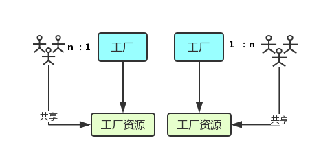

- 线程好比图中的工厂，有单独的专属自己的工厂资源
- 线程好比图中的工人，多个工人在一个工厂中协作工作，工厂与工人是1: n的关系，一个线程多个进程
- 多个工厂直接独立存在，资源不共享

### 1、进程与线程

- 进程：CPU资源分配的最小单位

- 线程：CPU调度的最小单位

- 特性：

  > - ##### 线程共享进程资源
  >
  >   > 进程是操作系统分配资源的基本单位，所以进程所需要的系统资源都是操作系统给的，而里面的线程要用资源的时候只能共享进程所拥有的的资源。这种资源包括内存空间，也包括操作系统的权限
  >
  > - ##### 一个线程崩溃，整个进程都跟着崩
  >
  >   >其实也很好理解，一个程序运行过程中，如果某个线程出错了，因为内存是共享的，那如果产生了错误的数据，整个进程最终执行结果也很可能是错的。所以操作系统就直接全部干掉了。
  >
  > - ##### 进程之间相互隔离，通过Inter-process communication（进程间相互通信）进行通信
  >
  >   > 虽然说一个进程就是一个应用程序，但有的时候一个应用程序也有可能会启动子进程，进程之间的数据又是隔离开的，各自为战。要同步某些数据内容，就可以通过某种进程间通信（IPC）的手段来进行

### 2、为什么 JS 是单线程的？

> 我们都知道，JavaScript从诞生之日就是一门**`单线程的非阻塞的脚本语言`**。这是由其 **`最初的用途来决定：与浏览器交互`**。
>
> 单线程意味着，JavaScript代码在执行的任何时候，都只有一个主线程来处理所有的任务。
>
> **`而非阻塞则是当代码需要进行一项异步任务（无法立刻返回结果，需要花一定时间才能返回的任务，如I/O事件，定时器事件等）的时候，主线程会挂起（pending）这个任务，然后再异步任务返回结果的时候再根据一定规则去执行相应的回调。`**
>
> 单线程是必要的，也是JavaScript这门语言的基石，原因之一在其最初也是最主要的执行环境——浏览器中，我们需要进行各种各样的dom操作。试想一下如果JavaScript是多线程的，那么当两个线程同时对dom进行一项操作，例如一个向其添加一个属性，另一个删除了这个dom，此时该如何处理呢？因此，为了保证不会发生类似这个例子的情景，JavaScript选择只用一个主线程来执行代码，这样就保证了程序执行的一致性
>
> 当然现如今人们也意识到，单线程在保证了执行顺序的同时也限制了JavaScript的效率，为了利用多核CPU的计算能力，HTML5提出Web Worker标准，允许JavaScript脚本创建多个线程，但是子线程完全受主线程控制，且不得操作DOM。所以，这个新标准并没有改变JavaScript单线程的本质。

### 3、浏览器进程

#### ①、多进程浏览器

> - Chrome
>- 新版IE
> - FireFox 54版浏览器 （FireFox 54版浏览器已经可以将全部打开的网页标签分为最多四个进程来运行，以此提升浏览器对PC硬件的利用率）

#### ②、单进程浏览器

> - Firefox54版之前
> - 老版IE

谷歌任务管理器：多线程

> 从更直观的例子来看，可以打开任务管理器查看，第一个 tab便是进程列表，每一个进程占有的 CPU资源和内存资源的比例很直观的展示出来。
>
> 一般来说一个Tab标签页面一个渲染进程（对于不一般的情况可以了解Site Isolation策略）；每个渲染进程中会运行Blink布局引擎，V8 JavaScript执行引擎等，单独服务于一个Tab标签页；运行在沙盒中无法访问系统资源。

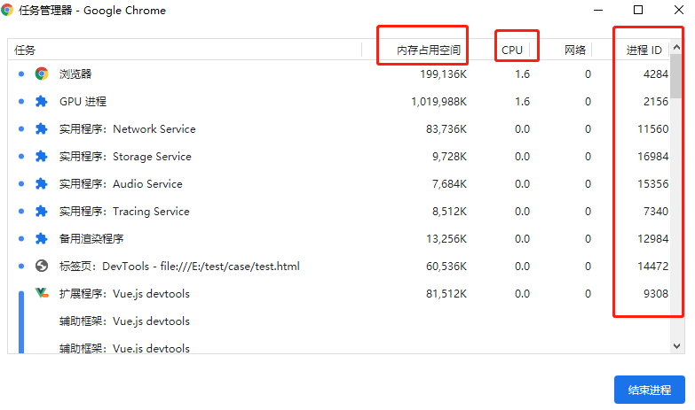

火狐任务管理器

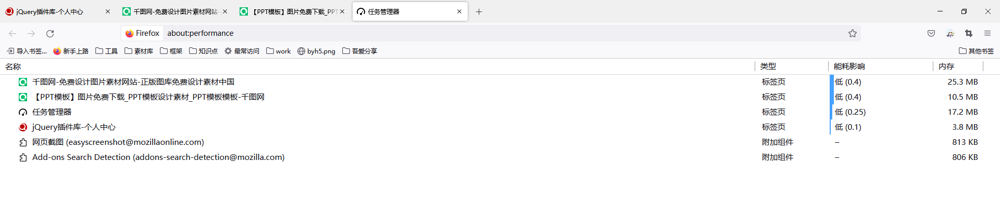

#### ③、浏览器内核

> 浏览器内核中有许多个线程同步工作，是支撑浏览器运行的最核心的程序

- ##### 不同浏览器的内核

>- Chrome, Safari : webkit
>- firefox : Gecko
>- IE	: Trident
>- 360,搜狗等国内浏览器: Trident + webkit

#### ④、浏览器进程

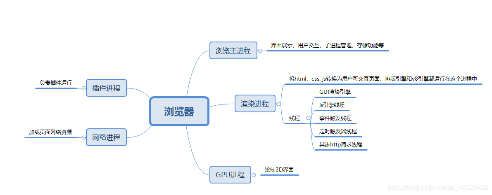


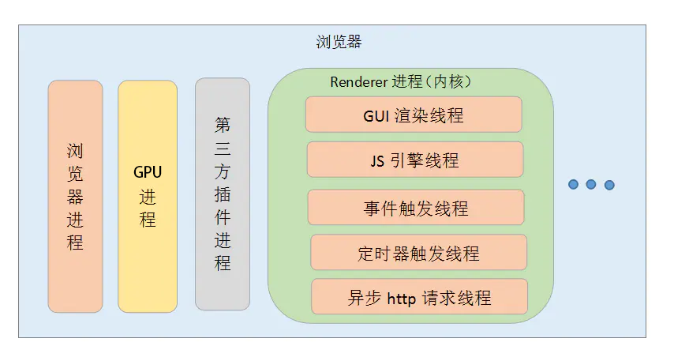

> 浏览器进程：
>
> ##### 1、浏览器主进程：主要负责页面管理以及管理其他进程的创建和销毁等
>
> ##### 2、GPU进程：绘制3D界面
>
> ##### 3、网络进程：加载页面网络资源
>
> ##### 4、插件进程：负责插件运行
>
> ##### 5、<strong style="color:#f00">渲染进程</strong>：将HTML，css转换为用户可交互页面，排版引擎和v8引擎都运行在这个进程中，常驻的线程有：
>
> - GUI渲染线程
> - JS引擎线程
> - 事件触发线程
> - 定时器触发线程
> - 异步HTTP请求线程

##### a、渲染进程详解

- ##### GUI渲染线程

> - 主要负责页面的渲染，解析HTML、CSS，构建DOM树，布局和绘制等
>
> - 当界面需要`重绘`或者由于某种操作引发`回流`时，将执行该线程
>
> - 该线程与JS引擎线程互斥，当执行JS引擎线程时，GUI渲染会被<strong style="color:#f00">`挂起（冻结）`</strong>，GUI更新会被保存在一个队列中，等到`JS引擎`空闲时立即被执行
>
> - 扩展：重绘、回流
>
>   > **`重绘`**：当渲染树中的一些元素需要更新属性，而这些属性只是影响元素的外观，而**不影响该节点在页面当中的空间位置及大小**。譬如某个div标签节点的背景颜色，字体颜色等发生改变，但是该div标签节点的宽、高、内外边距（盒模型）并不发生变化，此时触发浏览器重绘
>   >
>   > **`回流（重排）`**：当渲染树节点发生改变，影响了节点的几何属性（如宽、高、内外边距、或者float、position、display等等）导致元素节点位置发生变化，此时触发浏览器回流（重排），需要重新生成渲染树。譬如：JS为某个div标签节点添加新的样式：“display:none"。导致div标签被隐藏起来了，该div标签之后的所有节点位置都会发生变化。此时浏览器需要重新生成渲染树，重新布局，即回流
>   >
>   > 常见引起回流属性和方法：
>   >
>   > > （1）添加或者删除可见的 DOM 元素；
>   > > （2）元素尺寸改变——边距、填充、边框、宽度和高度
>   > > （3）内容变化，比如用户在 input 框中输入文字
>   > > （4）浏览器窗口尺寸改变——resize事件发生时
>   > > （5）计算 offsetWidth 和 offsetHeight 属性
>   > > （6）设置 style 属性的值
>   > > （7）当你修改网页的默认字体时。
>   >
>   > **`注意：回流必将引起重绘，而重绘不一定引起回流`**

- ##### JS引擎线程

>- 也称为JS内核（例如V8引擎等）
>
>- 主要负责处理JavaScript脚本程序，解析JavaScript脚本，运行代码
>
>- 也主要负责执行准备好的待执行的事件，即定时器结束，或者异步请求成功并正确返回时，将依次进入任务队列，等待JS引擎线程的执行
>
>- ##### 该线程与GUI渲染线程互斥，当JS引擎线程执行JavaScript脚本事件过长，将导致<strong style="color:#f00">页面渲染的加载阻塞</strong>

- ##### 事件触发线程

> - 归属于浏览器而不是 JS 引擎，用来控制事件循环（可以理解，JS 引擎自己都忙不过来，需要浏览器另开线程协助）
> - 当js引擎执行到点击事件，异步事件等等，都会将对应的任务添加到事件线程中，当事件符合触发条件时，会将事件添加到处理队列的队尾，等待JS引擎空闲后去执行（主要负责将准备好的事件交给JS引擎去执行）

- ##### 定时器触发线程

> - 负责执行setTimeout，setInterval所在线程
> - 浏览器定时计数器并不是JavaScript引擎计数的，因为JavaScript引擎是单线程的，如果处于阻塞进程状态就会影响计时的准确
> - 因此通过单独线程来计时并触发定时，计时完毕后，将事件添加到处理队列的队尾，等待JS引擎空闲去处理`（如果js引擎一直都没有处理也会影响计时的准确）`
>
> - 注意，W3C 在 HTML 标准中规定，规定要求 setTimeout 中低于 4ms 的时间间隔算为 4ms。

- ##### 异步HTTP请求线程

> 负责执行异步请求一类的函数的线程，如Promise，axios，ajax等
>
> 主线程依次执行代码时，遇到异步请求，会将函数交给该线程处理，当监听到状态变更，如果有回调函数，`事件触发线程`会将回调函数加入到任务队列的尾部，等待JS引擎线程执行

##### b、线程之间存在的关系？

- GUI渲染线程与JS引擎线程是互斥的

  > 原因很简单，假设你正在渲染一个元素让颜色变为红色，这个时候js又在操作DOM变为蓝色，同时都在操作同一个元素，那元素是什么颜色，会导致渲染出现不可预期的结果
  >
  > JS引擎线程在执行的时候有可能会发生重绘和回流。

- JS阻塞页面加载

  > 因为GUI渲染线程与JS引擎线程是互斥的，所以可以推导出，JS如果执行时间过长就会阻塞页面。
  >
  > 譬如，假设 JS 引擎正在进行巨量的计算，此时就算 GUI 有更新，也会被保存到队列中，等待 JS 引擎空闲后执行。 然后，由于巨量计算，所以 JS 引擎很可能很久很久后才能空闲，自然会感觉到巨卡无比。

##### c、扩展：浏览器输入URL到页面渲染完毕的过程

>- 1、首先浏览器在输入URL之后，会先解析URL，判断是否合法
>
>- 2、如果输入的URL合法，浏览器会查看`浏览器缓存`，判断是否有缓存，如果有，则显示
>
>- 3、如果没有缓存，浏览器会向服务器发送HTTP协议，会进行DNS解析，获取IP地址
>
>- 4、浏览器与服务器交互过程
>
> >1)、浏览器根据解析到的IP地址和端口号发起http请求（http请求包括header和body。header中包括请求的方式（get、post等等）、请求的协议（http、https）、请求的的地址ip、缓存cookie。body中有请求的内容）
> >
> >2)、HTTP到达传输层，浏览器利用TCP协议与服务器建立连接，进行三次握手
> >
> >3)、服务器接收到HTTP请求后，处理请求，并发送响应报文，将数据返回给浏览器
> >
> >4)、浏览器接收到返回的HTTP响应后，解析它。如果状态码显示成功，开始进行页面渲染
>
>- 5、浏览器利用渲染进程渲染页面
>
> >1)、渲染进程首先通过网络请求拿到要渲染的页面，之后开始从上到下依次解析
> >
> >2)、解析HTML文件，构建DOM树
> >
> >3)、解析CSS，构建CSSOM Tree（css规则树）
> >
> >4)、将dom树和css规则树合并，构建Render tree（渲染树）
> >
> >5)、reflow（重排）：根据Render tree进行节点信息计算
> >
> >6)、repaint（重绘）：根据计算好的信息绘制整个页面
> >
> >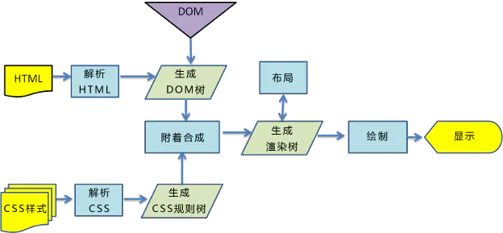


- ##### 第二步缓存过程分析详解

  > 缓存过程分析：浏览器与服务器通信的方式为应答模式，即是：浏览器发起HTTP请求——服务器响应该请求。那么浏览器第一次向服务器发起该请求后拿到请求结果，会根据响应报文中HTTP头的缓存标识，决定是否缓存结果，是则将请求结果和缓存标识存入浏览器缓存中，简单的过程如下图
  >
  > 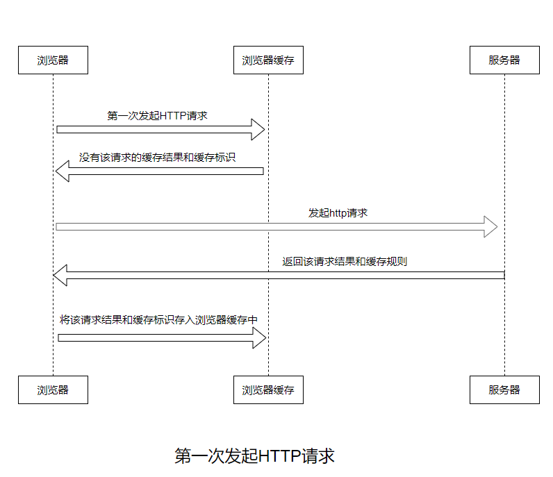
  >
  > 由上图可得知：
  >
  > - 浏览器每次发起请求，都会先在浏览器缓存中查找该请求的结果以及缓存标识
  > - 浏览器每次拿到返回的请求结果都会将该结果和缓存标识存入浏览器缓存中
  >
  > 缓存相关知识查看浏览器缓存一文---><a name="浏览器缓存" href="./浏览器缓存.md#test">按住Ctrl点我传送</a>

- ##### 3、第三步DNS域名解析过程详解：

  > 1）DNS名称解释
  >
  > DNS，全程Domain Name System，中文名为域名系统，是因特网的一项核心服务，它作为可以将域名和IP地址相互映射的一个分布式数据库，能够使人更方便地访问互联网，而不用去记住能够被机器直接获取的IP数串
  >
  > 以淘宝为例，www.taobao.com就是域名，但计算机并不能直接根据域名找到淘宝，必须转换为IP地址才能准确获取。而且淘宝ip地址可能会随着时间、网络、机器的变化而变化
  >
  > 2）DNS解析过程
  >
  > 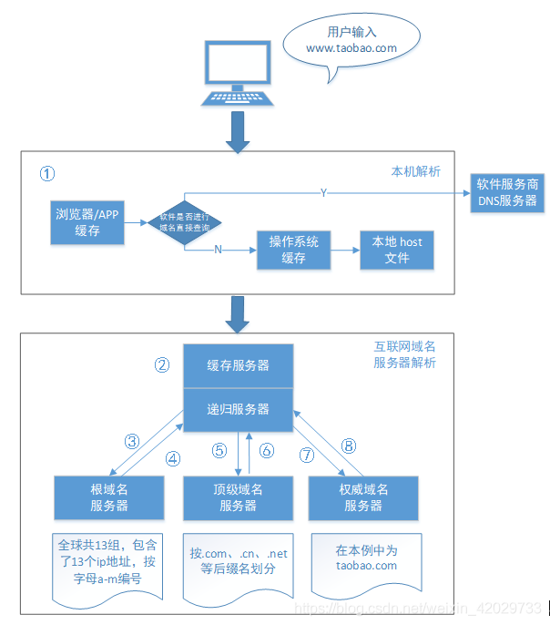
  >
  > - 本地解析
  >
  >   > 用户在本机浏览器输入www.taobao.com后，计算机会先在本地进行解析（图中为①），分成以下三小步
  >   >
  >   > - 1）先到浏览器的DNS缓存中查询是否有对应记录，如有则直接返回ip地址，完成解析，如果没有执行下一步
  >   > - 2）接着会进行一个判断：软件是否或浏览器是否进行域名直接查询。如果是的话，会直接连到软件服务商提供的DNS服务器上，并返回IP；如果没有，则继续查询操作系统的缓存；如有则直接返回IP地址，完成解析，如果没有则下一步
  >   > - 3）最后查看本地host文件，比如windows的host文件一般位于："C:\Windows\System32\drivers\etc"，如果这里也没有的话就需要到本地DNS服务器上查找了
  >
  > - 本地DNS服务器（简称LDNS）
  >
  >   包括两部分：缓存服务器和递归服务器
  >
  >   > - 缓存服务器有2种，一种是公共DNS服务器，比如114DNS（114.114.114.114）、Google DNS（8.8.8.8）；另一种是本地运营商提供的DNS服务器，浙江电信的DNS服务器包括：202.96.102.3、 61.175.111.61、 61.175.111.60、61.175.231.157、202.96.103.36（查询：http://www.qicaispace.com/teach/computer/page07/info08.asp）。普通用户使用的都是运营商的本地域名服务器，这些服务器一般架设在离用户不远的地方，而且性能都很好，多以一般都会缓存域名解析结果，大约80%的域名解析都会在这一步完成（图中为②）
  >   > - 如果缓存服务器无法找到对应IP，则会把学校传递给递归服务器
  >
  > - 根域名服务器（[全球13台根服务器10台在美国，如果美国关闭服务，我国会断网吗？](https://baijiahao.baidu.com/s?id=1732982455638057363&wfr=spider&for=pc)）
  >
  >   当信息传递给递归服务器后，会根据内置的根域名服务器IP地址，寻找根域名服务器的帮助
  >
  >   > - DNS域名服务器一般分为三种，分别是根域名服务器（.）、顶级域名服务器（.com）、权威域名服务器
  >   >
  >   >   > - 权威DNS服务器
  >   >   >   简而言之，权威DNS服务器是实际持有并负责DNS资源记录的服务器。这是DNS查找链底部的服务器，它将使用查询的资源记录进行响应，最终允许Web浏览器发出请求以访问访问网站或其他Web资源所需的IP地址。权威的名称服务器可以满足来自其自身数据的查询，而无需查询其他来源，因为它是某些DNS记录的最终真实来源。
  >   >
  >   > - 全球一共有13组根域名服务器（注：全世界IPv4根服务器只有13台，分别为"A"至"M"，1个为主根服务器在美国。其余12个均为辅根服务器，其中9个在美国，欧洲2个，位于英国和瑞典，亚洲1个位于日本），根域名服务器不会直接解析域名，而是把不同的解析请求分配给下面的其他服务器来完成
  >   >
  >   > - 举个例子，淘宝的域名是www.toabao.com，首先，就会去根域名服务器查找这个.com在什么地方；在查完了.com之后，才会再查taobao在上面地方，一级一查

## 二、Event Loop（事件循环）机制

浏览器的事件循环分为同步任务和异步任务，事件循环是一个**先进先出（FIFO）**的队列

### 1、同步任务和异步任务

- **同步任务**：所有同步任务都在主线程上执行，形成一个函数调用栈（执行栈），即可以立即执行的任务
- **异步任务**：异步任务则先放到**任务队列**里，**任务队列**又分为宏任务与微任务

js引擎遇到一个异步任务并不会一直等待其返回结果，而是会将这个任务挂起，继续执行执行栈中的其他任务。只要异步任务有了运行结果，就在任务队列最后添加一个事件，被放入任务队列不会立即执行其回调，而是表示相关的异步任务可以进入执行栈了

#### ①、为什么需要异步操作？

JavaScript语言的执行环境是单线程的，所谓单线程就是一次只能完成一件任务，如果有多个任务就要排队了，一个完成了，继续下一个，这种方式在实现来说非常简单。**但是如果一个任务耗时很长（比如一个一小时的定时器），那么后面的任务就需要排队等着，会拖延整个程序的执行**。常见的**浏览器无响应（假死）**就是因为某一段JavaScript代码长时间运行（比如死循环），导致整个页面卡死，其他任务无法执行。

 **异步模式非常重要，在浏览器端，耗时很长的操作都应该异步执行，避免浏览器失去响应**。最好的例子就是ajax操作，在**服务器端， 异步操作甚至是唯一方式，因为执行环境是单线程的，如果允许同步执行所有的http请求，服务器性能会急剧下降，很快就会失去响应。**

#### ②、常见的异步操作

> - Ajax
> - DOM的事件操作：即监听某个事件，当事件发生时，再执行相应的操作（比如点击、mouseover等）
> - 定时器：setInterval、setTimeout
> - 回调函数：**回调函数可以理解为异步，但不是严格的异步操作**
> - async await
> - promise.then()

#### ③、理解setTimeout与setInterval异步事件

在研究setTimeout与setInterval之前，可以先看一个小小的demo

```js
for(var i = 1; i <= 3; i++) {
    setTimeout(function(){
        console.log(i);
    },100);
}
```

如果不是很熟悉JavaScript的话，就会理所当然的认为for循环会打印出1,2,3，但是事实并不是这样的，会输出3次4。我们先来理解setTimeout，很多人会认为setTimeout的意思是：在100毫秒后执行setTimeout的回调函数，其实这种想法是错误的，setTimeout与setInterval真正含义如下：

- **setTimeout：在指定的毫秒数后，将定时任务处理的函数添加到执行队列的队尾**。

- **setInterval：按照指定的周期(以毫秒数计时)，将定时任务处理函数添加到执行队列的队尾。**

 setTimeout与setInterval且都是异步的，所以我们现在可以来理解下上面循环为什么一直都是4呢？其实调用setTimeout时候，会有一个延时事件排入队列，JavaScript会先将同步任务执行完成之后再去执行

### 2、执行流程

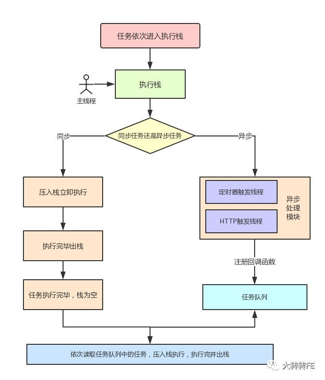

- 栈就像是一个容器，任务都是在栈中执行
- 主线程就像是操作员，负责执行栈中的任务
- 任务队列就像是等待被加工的物品
- 异步任务完成注册后会将回调函数加入任务队列等待主线程执行
- 执行栈中的同步任务执行完毕后，会查看并读取任务队列中的事件函数，于是任务队列的函数结束等待状态，进入执行栈，开始执行

#### ①、任务是如何入栈和出栈的呢？

入栈与出栈

```js
console.log(1)
function fn1 () {
    console.log(2)
}
function fn2 () {
    console.log(3)
    fn1()
}
setTimeout (function () {
	console.log(4);
}, 2000);
fn2();
console.log(5);
// 1 3 2 5 4
```

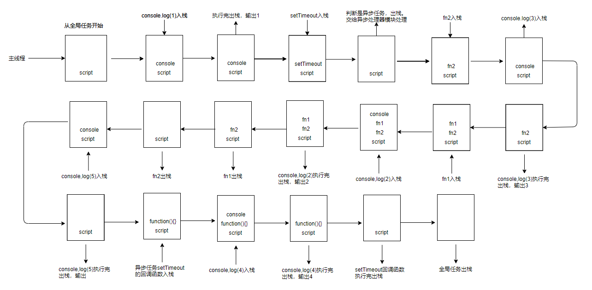

### 3、宏任务和微任务

异步任务分为：宏任务和微任务，宏任务队列可以有多个，微任务队列只有一个

- ##### 宏任务（macro task）

```text
script(整体代码)
setTimeout
setInterval
I/O
UI交互事件
postMessage
MessageChannel
setImmediate(Node.js 环境)
```

- ##### 微任务（micro task）

```text
Promise.then
Object.observe
MutationObserver
process.nextTick(Node.js 环境)
```

**在微任务中 process.nextTick 优先级高于Promise**

当一个异步任务入栈时，主线程判断该任务为异步任务，并把该任务交给异步处理模块处理，当异步处理模块处理完达到触发条件时，根据任务的类型，将回调函数压入任务队列

- 如果是宏任务，则新增一个宏任务队列，任务队列中的宏任务可以有多个来源
- 如果是微任务，则直接压入微任务队列尾

上图的任务队列可以细化如下：

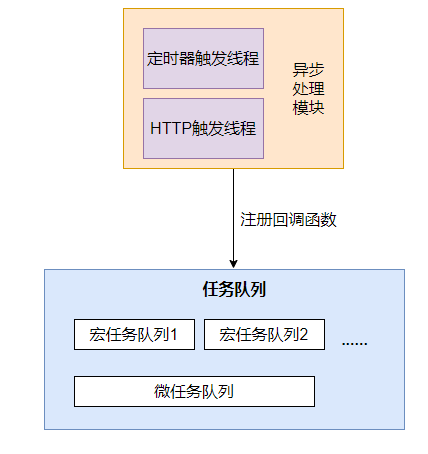

##### ①、宏任务和微任务的执行机制

上述除了当栈为空时，宏任务和微任务的执行机制是什么？这个问题之外，已经把事件循环的最基本的处理方式搞清楚了，但具体到异步任务中的宏任务和微任务，还没有弄明白，我们可以先顺一遍：

**执行机制**

- 从全局任务开始，任务依次进入栈中，被主线程执行，执行完后出栈
- 遇到异步任务，交给异步处理模块处理，对应的异步处理线程处理异步任务需要的操作，例如定时器的计数和异步请求监听状态的变更
- 当异步任务达到可执行状态时，事件触发线程将回调函数加入任务队列，等待栈为空时，依次进入栈中执行

到这里问题来了，当异步任务进入执行栈时，是宏任务还是微任务呢？

- 由于执行代码入口都是全局任务，而全局任务属于宏任务，所以当栈为空，<strong style="color:#f00">`同步任务执行完毕时，会先执行微任务队列里的任务`</strong>
- 微任务队列里的任务<strong style="color:#f00">`全部执行完毕后，读取宏任务队列中排最前的任务`</strong>

- 执行宏任务的过程中，遇到微任务，依次加入微任务队列
- 栈空后，再次读取微任务队列里的任务，依次类推

##### ②、实例解析

```js
setTimeout(function () {
	console.log(1);
	Promise.resolve().then(function () {
		console.log(2);
	});
}, 0);
setTimeout(function () {
	console.log(3);
}, 0);
Promise.resolve().then(function () {
	console.log(4);
});
console.log(5);
```

输出结果为： // 5 4 1 2 3

**第一轮循环**

- 同样从全局任务入口，遇到异步任务中的宏任务setTimeout，交给异步处理模块，暂且标记为setTimeout1，由于等待时间为 0，直接加入宏任务队列。
- 再次遇到异步任务中的宏任务setTimeout，交给异步处理模块，我们暂且先记为 setTimeout2，同样直接加入宏任务队列。
- 遇到异步任务中的微任务 then()，加入微任务队列。
- 最后遇到同步任务打印语句，直接打印日志 5，同步任务全部执行完成

第一轮结束图示：

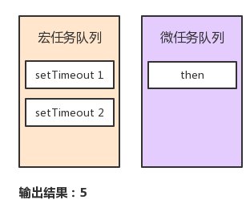

**第二轮循环**

- 栈空后，先执行微任务队列中的then()方法，输出4，此时微任务队列为空

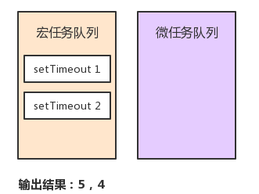

- 读取宏任务队列的最靠前的任务setTimeout1
- 先直接执行打印语句，打印日志：1，又遇到微任务then()，加入微任务队列。第二轮循环结束

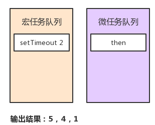

**第三轮循环**

- 先执行微任务队列中的then()方法，输出2，此时微任务队列为空

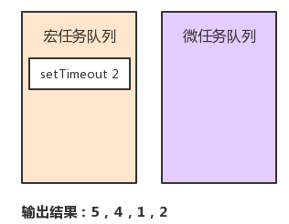

- 继续读取宏任务队列的最靠前任务setTimeout2
- 直接执行打印语句，打印日志：3。第三轮循环结束，执行完毕

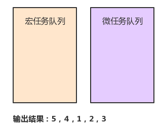

##### ③、练习题

```js
		console.log('1');//
		setTimeout(function () {
			console.log('2'); //
			new Promise(function (resolve) {
				console.log('3');//
				resolve();
			}).then(function () {
				console.log('4') //
			})
		})
		new Promise(function (resolve) {
			console.log('5'); // 这个属于同步任务
			resolve();
		}).then(function () {
			console.log('6') // 微任务
		})
		setTimeout(function () {
			console.log('7'); //
		})
		setTimeout(function () {
			console.log('8'); //
			new Promise(function (resolve) {
				console.log('9');
				resolve();
			}).then(function () {
				console.log('10')//
			})
		})
		new Promise(function (resolve) {
			console.log('11');//
			resolve();
		}).then(function () {
			console.log('12')//
		})
		console.log('13');//

		// 1 5 11 13 6 12 2 3 4 7 8 9 10
```

